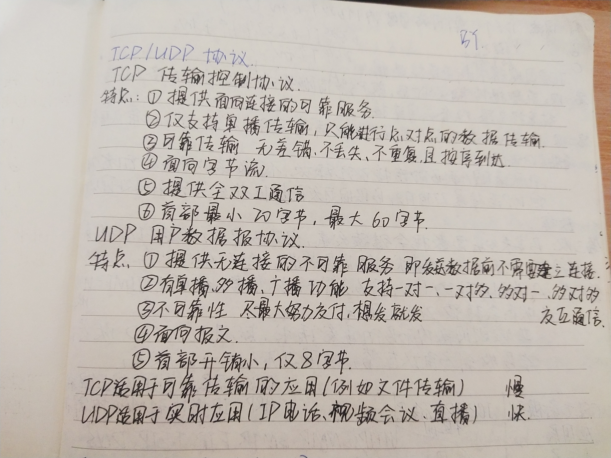
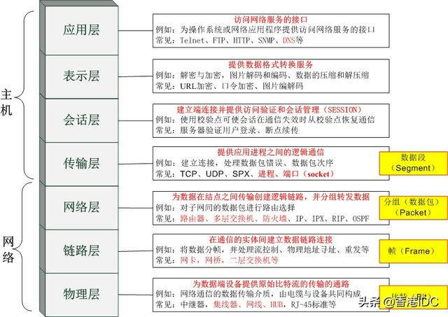
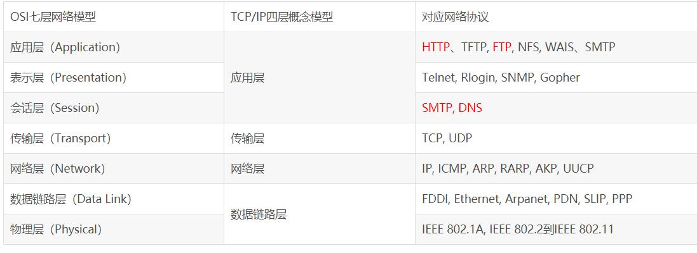

## 输入URL发生什么
## 三次握手四次挥手 为什么
## TCP UDP区别

## OSI七层模型

>http://www.360doc.com/content/19/1113/20/44130189_873007940.shtml
>http://www.360doc.com/content/19/1231/09/410279_883261724.shtml

> all  people seem to need data processing 所有的人似乎都需要处理数据
 

+ 应用层：文件传输，电子邮件，文件服务，虚拟终端
+ 表示层：数据格式化，代码转换，数据加密
+ 会话层：接触或建立与其他节点的联系
+ 传输层：提供端对端的接口
+ 网络层：为数据包选择路由
+ 数据链路层：传输有地址的帧，错误检测功能
+ 物理层：以二进制在物理媒体上传输数据

>https://www.cnblogs.com/lemo-/p/6391095.html
