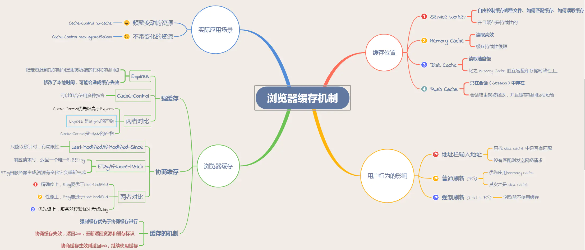
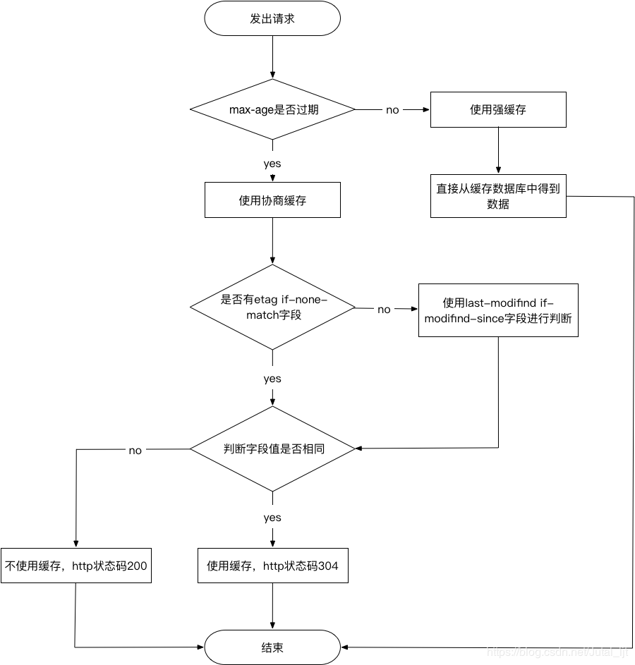

> https://blog.csdn.net/qq_42098849/article/details/104826854

1. 减少了冗余的数据传输，节省了网费
2. 减少了服务器的负担，大大提升了网站的性能
3. 加快了客户端加载网页的速度
4. 减少带宽，降低网络负荷
<hr />



> https://upload-images.jianshu.io/upload_images/3174701-8e74b69ad9376710

1. **强缓存**：不会向服务器发送请求，直接从缓存中读取资源，在 chrome 控制台的 network 选项中可以看到该请求返回 200 的状态码;
   - 并且 Size 显示 from disk cache 或 from memory cache 浏览器读取缓存的顺序为 memory > disk
   - `Cache-Control`的优先级比`Expires`高
2. **协商缓存**：向服务器发送请求，服务器会根据这个请求的 request header 的一些参数来判断是否命中协商缓存，如果命中，则返回 304 状态码并带上新的 response header 通知浏览器从缓存中读取资源；
   - `Last-Modified / If-Modified-Since` 和 `Etag / If-None-Match`
   - `Etag / If-None-Match`的优先级比 L`ast-Modified / If-Modified-Since`高
   - 同时存在则只有 Etag / If-None-Match 生效
3. 两者的共同点是都是从客户端缓存中读取资源；区别是强缓存不会发请求，协商缓存会发请求。

## 强缓存

强制缓存就是向浏览器缓存查找该请求结果，并根据该结果的缓存规则来决定是否使用该缓存结果的过程

- 不存在该缓存结果和缓存标识，强制缓存失效，则直接向服务器发起请求（跟第一次发起请求一致）
- 存在该缓存结果和缓存标识，但是结果已经失效，强制缓存失效，则使用协商缓存
- 存在该缓存结果和缓存标识，且该结果没有还没有失效，强制缓存生效，直接返回该结果

#### 强制缓存的缓存规则

- 当浏览器向服务器发送请求的时候，服务器会将缓存规则放入 HTTP 响应的报文的 HTTP 头中和请求结果一起返回给浏览器，
- 控制强制缓存的字段分别是 Expires 和 Cache-Control，其中 Cache-Control 的优先级比 Expires 高。

## 协商缓存

协商缓存就是强制缓存失效后，浏览器携带缓存标识向服务器发起请求，由服务器根据缓存标识决定是否使用缓存的过程

- 协商缓存生效，返回 304
- 协商缓存失败，返回 200 和请求结果
  

### 缓存位置

- Service Worker 运行在浏览器背后的独立线程
  - 使用 Service Worker 的话，传输协议必须为 HTTPS ==》 Service Worker 中涉及到请求拦截
  - Service Worker 的缓存与浏览器其他内建的缓存机制不同，它可以让我们自由控制缓存哪些文件、如何匹配缓存、如何读取缓存，并且缓存是持续性的。
- Memory Cache 内存中的缓存 快速读取和时效性
  - 一旦该进程关闭，则该进程的内存则会清空
  - js 和图片等文件解析执行后直接存入内存缓存中
  - css 文件则会存入硬盘文件
- Disk Cache 硬盘中的缓存
  - 读取缓存需要对该缓存存放的硬盘文件进行 I/O 操作
  - 重新解析该缓存内容，读取复杂，速度比内存缓存慢
- Push Cache 推送缓存

### 浏览器缓存过程

在浏览器第一次发起请求时，本地无缓存，向 web 服务器发送请求，服务器端响应请求，浏览器端缓存。过程如下：

- 强制缓存优先于协商缓存进行，若强制缓存(`Expires和Cache-Control`)生效则直接使用缓存，
- 若不生效则进行协商缓存(`Last-Modified / If-Modified-Since和Etag / If-None-Match`)，
- 协商缓存由服务器决定是否使用缓存，若协商缓存失效，那么代表该请求的缓存失效，重新获取请求结果，再存入浏览器缓存中；生效则返回 304，继续使用缓存，主要过程如下：
  
  

### 用户行为对浏览器缓存的控制

- 地址栏访问，链接跳转是正常用户行为，将会触发浏览器缓存机制；
- F5 刷新，浏览器会设置 max-age=0，跳过强缓存判断，会进行协商缓存判断；
- ctrl+F5 刷新，跳过强缓存和协商缓存，直接从服务器拉取资源。

### 三级缓存原理 (访问缓存优先级)

1. 先在内存中查找,如果有,直接加载。
2. 如果内存中不存在,则在硬盘中查找,如果有直接加载。
3. 如果硬盘中也没有,那么就进行网络请求。
4. 请求获取的资源缓存到硬盘和内存。

### HTTP 响应头中的 ETag 是如何生成的

关于 etag 的生成需要满足几个条件：

- 当文件不会更改时，etag 值保持不变。所以不能单纯使用 inode
- 便于计算，不会特别耗 CPU。这样子 hash 不是特别合适
- 便于横向扩展，多个 node 上生成的 etag 值一致。这样子 inode 就排除了

nginx 中 etag 由响应头的 `Last-Modified` 与 `Content-Length` 表示为十六进制组合而成。

```js
etag = '{:x}-{:x}'.format(header.last_modified, header.content_lenth);
```

```js
new Date(parseInt('5cbee66d', 16) * 1000).toJSON();
('2019-04-23T10:18:21.000Z');

parseInt('264', 16);
612;
```

### 如果 http 响应头中 ETag 值改变了，是否意味着文件内容一定已经更改

- 不一定，由服务器中 ETag 的生成算法决定。
- 比如 nginx 中的 etag 由 last_modified 与 content_length 组成，而 last_modified 又由 mtime 组成
- 当编辑文件却未更改文件内容时，或者 touch file，mtime 也会改变，此时 etag 改变，但是文件内容没有更改。

## Etag - 作用

Etag 主要为了解决 Last-Modified 无法解决的一些问题。

1.  一些文件也许会周期性的更改，但是他的内容并不改变(仅仅改变的修改时间)，这个时候我们并不希望客户端认为这个文件被修改了，而重新 GET;
2.  某些文件修改非常频繁，比如在秒以下的时间内进行修改，(比方说 1s 内修改了 N 次)，If-Modified-Since 能检查到的粒度是 s 级的，这种修改无法判断(或者说 UNIX 记录 MTIME 只能精确到秒)
3.  某些服务器不能精确的得到文件的最后修改时间；

## Etag - 工作原理

Etag 由服务器端生成，客户端通过 If-Match 或者说 If-None-Match 这个条件判断请求来验证资源是否修改。常见的是使用 If-None-Match.请求一个文件的流程可能如下：

====第一次请求===

1. 客户端发起 HTTP GET 请求一个文件；
2. 服务器处理请求，返回文件内容和一堆 Header，当然包括 Etag(例如"2e681a-6-5d044840")(假设服务器支持 Etag 生成和已经开启了 Etag).状态码 200

====第二次请求===

1. 客户端发起 HTTP GET 请求一个文件，注意这个时候客户端同时发送一个 If-None-Match 头，这个头的内容就是第一次请求时服务器返回的 Etag：2e681a-6-5d044840
2. 服务器判断发送过来的 Etag 和计算出来的 Etag 匹配，因此 If-None-Match 为 False，不返回 200，返回 304，客户端继续使用本地缓存；
