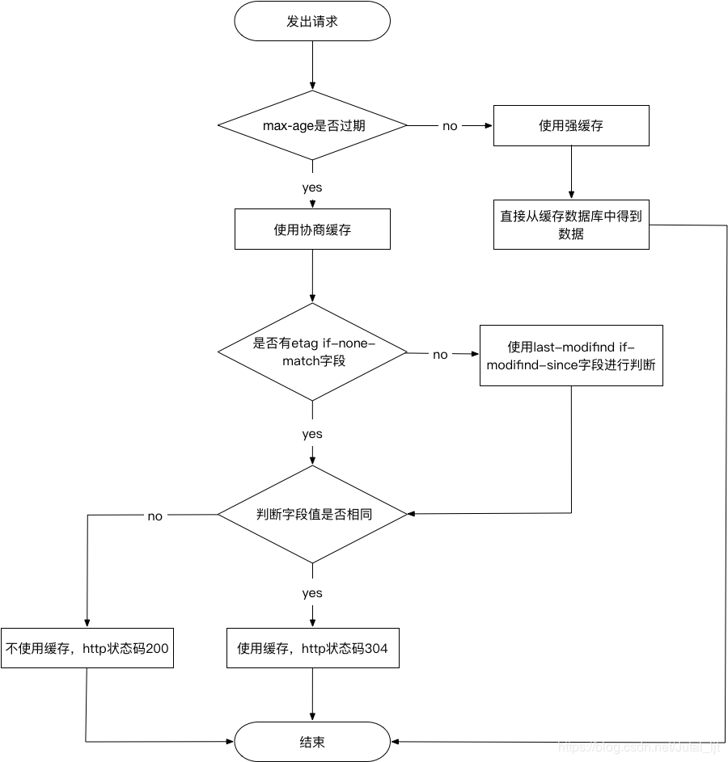

> https://www.cnblogs.com/lovesong/p/5021992.html

HTML5离线缓存又名Application Cache，是从浏览器的缓存中分出来的一块缓存区，要想在这个缓存中保存数据，可以使用一个描述文件（manifest file），列出要下载和缓存的资源。

## 应用程序缓存
应用程序缓存是 HTML5  的重要特性之一，提供了离线使用的功能，让应用程序可以获取本地的网站内容，例如 HTML 、 CSS 、图片以及 JavaScript 。这个特性可以提高网站性能，它的实现借助于 `manifest` 文件，如下：
```html
<!doctype html>

<html manifest=”example.appcache”>

</html>
```

1. 在线的情况下，浏览器发现 html 标签有 manifest 属性，它会请求 manifest 文件
2. 如果是第一次访问app，那么浏览器就会根据 manifest 文件的内容下载相应的资源并且进行离线存储
3. 如果已经访问过app且资源已经离线存储了，浏览器会对比新的 manifest 文件与旧的 manifest 文件，如果文件没有发生改变，就不做任何操作。如果文件改变了，那么就会重新下载文件中的资源并进行离线存储
4. 离线的情况下，浏览器就直接使用离线存储的资源

与传统浏览器缓存相比，它不强制用户访问的网站内容被缓存
**优点：** 
+ 提供离线缓存，离线时可以使用，
+ 加载速度快，提高了网页的性能，
+ 减少服务器负载：浏览器只从服务器下载更新的或者更改过的资源

## HTTP缓存浏览器缓存
&emsp;&emsp;浏览器的缓存机制也就是我们说的HTTP缓存机制，其机制是根据HTTP报文的缓存标识进行的。

&emsp;浏览器和服务器进行Http通信时发送的数据即为Http报文，其中分为两部分：
+ `header` - 报文的首部或头部，其中保存着各类请求的属性字段，关于Http的缓存相关规则信息均保存在header中
+ `body` - 请求体部分，Http请求真正传输的主体部分

&emsp;&emsp;Http缓存主要分为两种：
+ 强缓存
+ 协商缓存

根据响应的`header`内容来决定：

获取资源形式     | 获取资源形式 | 状态码 | 发送请求到服务器
-------- | ----- | ----- | ----- 
强缓存  | 从缓存取 | 200（from cache） |否，直接从缓存取
协商缓存  | 从缓存取 | 304（not modified） | 是，通过服务器来告知缓存是否可用


### 强缓存（时效缓存）
&emsp;&emsp;强缓存相关字段有`expires`，`cache-control`。如果`cache-control`与`expires`同时存在的话，`cache-control`的优先级高于`expires`， 即：cache-control优先级比expires高。

控制强制缓存的字段分别有

**1. expires： 表示未来资源会过期的时间**
	&emsp;&emsp;即当发起请求的时间超过了 expires 设定的时间，会发送请求到服务器重新获取资源。
	
**2. cache-control: 取值有五种**, 如下： 

+ `private`：客户端可以缓存（默认值）
+ `public`：客户端和代理服务器均可缓存；
+ `max-age=xxx`：缓存的资源将在 xxx 秒后过期；
+ `no-cache`：需要使用协商缓存来验证是否过期；
+ `no-store`：不可缓存（所有内容都不会缓存，强制缓存，协商缓存都不会触发）

### 协商缓存（非时效缓存）
协商缓存相关字段有`Last-Modified/If-Modified-Since`，`Etag/If-None-Match`

1）在`http 1.0`版本中，第一次请求，服务器通过 `Last-Modified` 来设置响应头的缓存标识，并且把资源最后修改的时间作为值填入，然后将资源返回给浏览器。

在第二次请求时，浏览器会首先带上 `If-Modified-Since` 请求头去访问服务器，服务器会将 `If-Modified-Since` 中携带的时间与资源修改的时间匹配。

+ 时间不一致，服务器返回新资源，且将Last-Modified值更新，作为响应头返回给浏览器。
+ 时间一致，表示资源没有更新，服务器返回304状态码，浏览器读取缓存资源。

2）在 `http 1.1` 版本中，在第一次请求时，服务器通过 `Etag` 来设置响应头缓存标识，并将资源和 `Etag` 一并返回给浏览器，浏览器缓存到本地。

在第二次请求时，浏览器会将 `Etag` 信息放到 `If-None-Match` 请求头去访问服务器，服务器收到请求后，会将服务器中的文件标识与浏览器发来的标识进行对比，
+ 不相同，服务器返回更新资源和新Etag.   
+ 相同，服务器返回 304 ，浏览器读取缓存。

**注：弊端**，就是当服务器中的资源增加了一个字符，后来又把这个字符删掉，本身资源文件并没有发生变化，但修改时间发生了变化。当下次请求过来时，服务器也会把这个本来没有变化的资源重新返回给浏览器。

总结：强制缓存优先于协商缓存进行，若强制缓存(Expires和Cache-Control)生效则直接使用缓存，若不生效则进行协商缓存(Last-Modified / If-Modified-Since和Etag / If-None-Match)，协商缓存由服务器决定是否使用缓存，若协商缓存失效，那么代表该请求的缓存失效，重新获取请求结果，再存入浏览器缓存中；生效则返回304，继续使用缓存

参考于：
+ [https://blog.csdn.net/jutal_ljt/article/details/80021545](https://blog.csdn.net/jutal_ljt/article/details/80021545)
+ [https://www.cnblogs.com/renzm0318/p/11073881.html](https://www.cnblogs.com/renzm0318/p/11073881.html)