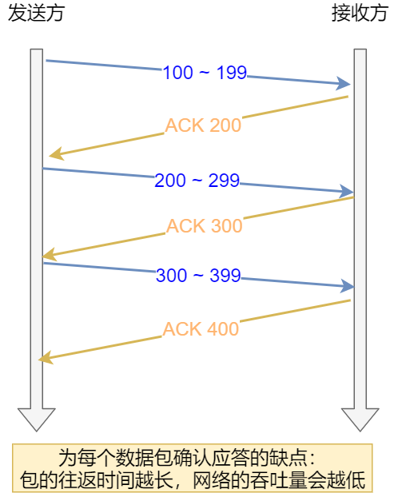
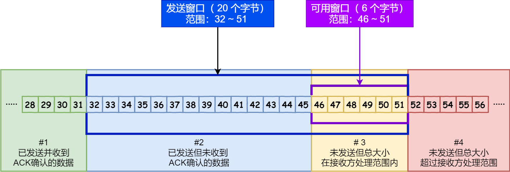

> https://www.cnblogs.com/xiaolincoding/p/12732052.html

# 重传机制
TCP 实现可靠传输的方式之一，是通过序列号与确认应答。

TCP 针对数据包丢失的情况，会用重传机制解决。

常见的重传机制：
+ 超时重传
+ 快速重传
+ SACK
+ D-SACK

## 超时重传

重传机制的其中一个方式，就是在发送数据时，设定一个定时器，当超过指定的时间后，没有收到对方的 ACK 确认应答报文，就会重发该数据，也就是我们常说的超时重传。

TCP 会在以下两种情况发生超时重传：数据包丢失 确认应答丢失

### 超时时间应该设置为多少呢？
RTT 数据从网络一端传送到另一端所需的时间，也就是包的往返时间

超时重传时间是以 RTO （超时重传时间）表示。

假设在重传的情况下，超时时间 RTO 「较长或较短」时，会发生什么事情呢？

+ 当超时时间 RTO 较大时，重发就慢，丢了老半天才重发，没有效率，性能差；
+ 当超时时间 RTO 较小时，会导致可能并没有丢就重发，于是重发的就快，会增加网络拥塞，导致更多的超时，更多的超时导致更多的重发。
+ 所以超时重传时间 RTO 的值应该略大于报文往返 RTT 的值

* 实际上「报文往返 RTT 的值」是经常变化的，因为我们的网络也是时常变化的。
* 也就因为「报文往返 RTT 的值」 是经常波动变化的，所以「超时重传时间 RTO 的值」应该是一个动态变化的值。

## 快速重传
+ 快速重传（Fast Retransmit）机制，它不以时间为驱动，而是以数据驱动重传。
+ 快速重传的工作方式是当收到三个相同的 ACK 报文时，会在定时器过期之前，重传丢失的报文段。
+ 问题： 重传的时候，是重传之前的一个，还是重传所有的问题
+ 根据 TCP 不同的实现，以上两种情况都是有可能的

## SACK 方法
+ 还有一种实现重传机制的方式叫：SACK（ Selective Acknowledgment 选择性确认）。
+ 在 TCP 头部「选项」字段里加一个 SACK 的东西，它可以将缓存的地图发送给发送方，这样发送方就可以知道哪些数据收到了，哪些数据没收到，知道了这些信息，就可以只重传丢失的数据。

## Duplicate SACK
+ 又称 D-SACK，其主要使用了 SACK 来告诉「发送方」有哪些数据被重复接收了。

D-SACK 有这么几个好处：
+ 可以让「发送方」知道，是发出去的包丢了，还是接收方回应的 ACK 包丢了;
+ 可以知道是不是「发送方」的数据包被网络延迟了;
+ 可以知道网络中是不是把「发送方」的数据包给复制了;

# 滑动窗口
+ TCP 是每发送一个数据，都要进行一次确认应答。当上一个数据包收到了应答了， 再发送下一个。

+ 所以，这样的传输方式有一个缺点：数据包的往返时间越长，通信的效率就越低。
+ 为解决这个问题，TCP 引入了窗口这个概念。即使在往返时间较长的情况下，它也不会降低网络通信的效率。
+ 窗口大小，窗口大小就是指无需等待确认应答，而可以继续发送数据的最大值。

+ 窗口的实现实际上是操作系统开辟的一个缓存空间，发送方主机在等到确认应答返回之前，必须在缓冲区中保留已发送的数据。如果按期收到确认应答，此时数据就可以从缓存区清除。
+ 假设窗口大小为 3 个 TCP 段，那么发送方就可以「连续发送」 3 个 TCP 段，并且中途若有 ACK 丢失，可以通过「下一个确认应答进行确认」。如下图：

+ 图中的 ACK 600 确认应答报文丢失，也没关系，因为可以通过下一个确认应答进行确认，只要发送方收到了 ACK 700 确认应答，就意味着 700 之前的所有数据「接收方」都收到了。
+ 这个模式就叫累计确认或者累计应答。

##窗口大小由哪一方决定？
TCP 头里有一个字段叫 Window，也就是窗口大小。
+ 这个字段是接收端告诉发送端自己还有多少缓冲区可以接收数据。于是发送端就可以根据这个接收端的处理能力来发送数据，而不会导致接收端处理不过来。
+ 通常窗口的大小是由接收方的窗口大小来决定的。
+ 发送方发送的数据大小不能超过接收方的窗口大小，否则接收方就无法正常接收到数据。

## 发送方的滑动窗口

+ `#1` 是已发送并收到 ACK确认的数据：1~31 字节
+ `#2` 是已发送但未收到 ACK确认的数据：32~45 字节
+ `#3` 是未发送但总大小在接收方处理范围内（接收方还有空间）：46~51字节
+ `#4` 是未发送但总大小超过接收方处理范围（接收方没有空间）：52字节以后

https://www.cnblogs.com/xiaolincoding/p/12732052.html
# 拥塞控制
+ 流量控制是避免「发送方」的数据填满「接收方」的缓存
+ 拥塞控制，控制的目的就是避免「发送方」的数据填满整个网络

## 什么是拥塞窗口？和发送窗口有什么关系呢？
+ 拥塞窗口 cwnd是发送方维护的一个的状态变量，它会根据网络的拥塞程度动态变化的。

+ 发送窗口 swnd 和接收窗口 rwnd 是约等于的关系
+ 加入了拥塞窗口的概念后，此时发送窗口的值是swnd = min(cwnd, rwnd)，也就是拥塞窗口和接收窗口中的最小值。

拥塞窗口 cwnd 变化的规则：
+ 只要网络中没有出现拥塞，cwnd 就会增大；
+ 但网络中出现了拥塞，cwnd 就减少；

## 那么怎么知道当前网络是否出现了拥塞呢？
其实只要「发送方」没有在规定时间内接收到 ACK 应答报文，也就是发生了超时重传，就会认为网络出现了用拥塞。

## 拥塞控制有哪些控制算法？

### 慢启动
+ 慢启动的算法记住一个规则就行：当发送方每收到一个 ACK，拥塞窗口 cwnd 的大小就会加 1。
+ 慢启动算法，发包的个数是指数性的增长
+ 慢启动涨到什么时候是个头呢？
    + 有一个叫慢启动门限 ssthresh （slow start threshold）状态变量。
        + 当 cwnd < ssthresh 时，使用慢启动算法。
        + 当 cwnd >= ssthresh 时，就会使用「拥塞避免算法」。

### 拥塞避免
+ 当拥塞窗口 cwnd 「超过」慢启动门限 ssthresh 就会进入拥塞避免算法。
+ 拥塞避免算法后，它的规则是：每当收到一个 ACK 时，cwnd 增加 1/cwnd。
+ 拥塞避免算法就是将原本慢启动算法的指数增长变成了线性增长，还是增长阶段，但是增长速度缓慢了一些。

### 拥塞发生
#### 发生超时重传的拥塞发生算法
这个时候，ssthresh 和 cwnd 的值会发生变化：
+ ssthresh 设为 cwnd/2，
+ cwnd 重置为 1
+ 接着，就重新开始慢启动，慢启动是会突然减少数据流的。这真是一旦「超时重传」，马上回到解放前。但是这种方式太激进了，反应也很强烈，会造成网络卡顿。
#### 发生快速重传的拥塞发生算法
+ cwnd = cwnd/2 ，也就是设置为原来的一半;
+ ssthresh = cwnd;
+ 进入快速恢复算法
### 快速恢复

