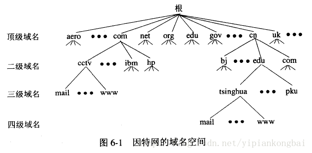
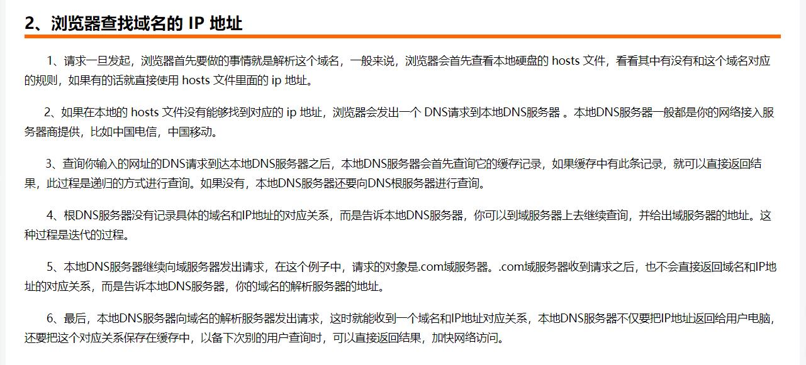

DNS 的作用就是通过域名查询到具体的 IP

因为 IP 存在数字和英文的组合（IPv6），很不利于人类记忆，所以就出现了域名

DNS在区域传输的时候使用TCP协议，其他时候使用UDP协议。

**DNS 是基于 UDP 做的查询**
+ 客户端向DNS服务器查询域名，一般返回的内容都不超过512字节，用UDP传输即可。不用经过三次握手，这样DNS服务器负载更低，响应更快。
+ 「DNS 使用 UDP 协议作为传输层协议的主要原因是为了避免使用 TCP 协议时造成的连接时延。」
+ 为了得到一个域名的 IP 地址，往往会向多个域名服务器查询，如果使用 TCP 协议，那么每次请求都会存在连接时延，这样使 DNS 服务变得很慢。
+ 大多数的地址查询请求，都是浏览器请求页面时发出的，这样会造成网页的等待时间过长

+ 操作系统会首先在本地缓存中查询 IP
+ 没有的话会去系统配置的 DNS 服务器中查询
+ 如果这时候还没得话，会直接去 DNS 根服务器查询，这一步查询会找出负责 com 这个一级域名的服务器
+ 然后去该服务器查询 google 这个二级域名
+ 接下来三级域名的查询其实是我们配置的，你可以给 www 这个域名配置一个 IP，然后还可以给别的三级域名配置一个 IP

以上介绍的是 DNS 迭代查询，还有种是递归查询

区别就是:
+ 迭代查询是由客户端去做请求，
+ 递归查询是由系统配置的 DNS 服务器做请求，得到结果后将数据返回给客户端。

+ 主机向本地域名服务器的查询一般都是采用递归查询。
+ 递归查询返回的查询结果或者是所要查询的IP地址，或者是报错，表示无法查询到所需的IP地址。
+ 本地域名服务器向根域名服务器的查询的迭代查询

+「本地服务器查询是递归查询」
+「本地 DNS 服务器向其他域名服务器请求的过程是迭代查询的过程」

+ 客户端-本地dns服务端：这部分属于递归查询。
+ 本地dns服务端---外网：这部分属于迭代查询。
+ 递归查询时，返回的结果只有两种:查询成功或查询失败.
+ 迭代查询，又称作重指引,返回的是最佳的查询点或者主机地址.

DNS系统有哪几类域名服务器组成:
+ 顶级域名服务器
+ 根域名服务器
+ 权限域名服务器 
+ 本地域名服务器