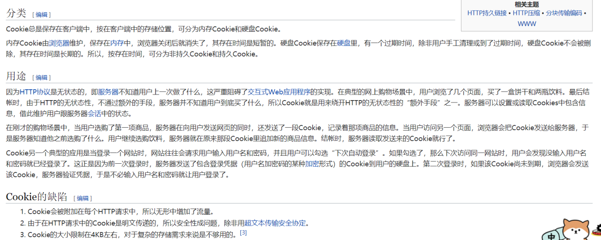

https://www.cnblogs.com/milantgh/p/3651554.html

## cookie 作用机制？

- 首先，客户端会发送一个 http 请求到服务器端
- 服务器端接受客户端请求后，发送一个 http 响应到客户端，这个响应头，其中就包含 Set-Cookie 头部
- 如果客户端同意使用 cookie，客户端第一次请求服务器时，服务器会创建一个带有 id 的 cookie，并在发送响应时给 header 加一个属性：“set-cookie: jsessionid=XXXX” ，将 cookie 发送给客户端
- 客户端收到响应后，将 cookie 保存在本地，比如浏览器。下次访问服务器时，将请求的 cookie header 加入 cookie 信息发送给服务器，服务器就可以根据客户端包装在请求中的 cookie 确定客户端身份

即： 用户在提交第一次请求后, 由服务器生成 Cookie,并将其封装到响应头中,以响应的形式发送给客户端。
客户端接收到这个响应后,将 Cookie 保存到客户端。
当客户端再次发送同类请求后，在请求中会携带保存在客户端的 Cookie 数据，发送到服务端，由服务器对会话进行跟踪。

## Cookie 分类

- Cookie 总是保存在客户端中，按在客户端中的存储位置，可分为内存 Cookie 和硬盘 Cookie.
- 内存 Cookie 由浏览器维护，保存在内存中，浏览器关闭后就消失了，其存在时间是短暂的。
- 硬盘 Cookie 保存在硬盘里，有一个过期时间，除非用户手工清埋或到了过期时间，硬盘 Cookie 不会被删除，其存在时间是长期的。
- 所以，按存在时间，可分为非持久 Cookie 和持久 Cookie。

cookie 是由若干键值对构成:

- 键：name， 值：value；键值对均为字符串
- Cookie 以名/值对形式存储

## JS 设置 cookie

JavaScript 可以使用 document.cookie 属性来创建 、读取、及删除 cookie

### 创建 cookie:

`document.cookie="username=John Doe";`

- 为 cookie 添加一个过期时间（以 UTC 或 GMT 时间）,默认情况下，cookie 在浏览器关闭时删除：
- cookie 的时效： expires

```js
document.cookie = 'username=John Doe; expires=Thu, 18 Dec 2043 12:00:00 GMT';
```

- 使用 **path** 参数告诉浏览器 cookie 的路径。默认情况下，cookie 属于当前页面

```js
document.cookie =
  'username=John Doe; expires=Thu, 18 Dec 2043 12:00:00 GMT; path=/';
```

### 读取 Cookie

```js
var x = document.cookie;
```

### 修改 Cookie

修改 cookie 类似于创建 cookie 旧的 cookie 将被覆盖。

```js
document.cookie =
  'username=John Smith; expires=Thu, 18 Dec 2043 12:00:00 GMT; path=/';
```

### 删除 Cookie

只需要设置 expires 参数为以前的时间即可，
当您删除时不必指定 cookie 的值

## Cookie 相关的 Http 头

两个 Http 头部和 Cookie 有关：Set-Cookie 和 Cookie

- Set-Cookie 由服务器发送，它包含在响应请求的头部中。它用于在客户端创建一个 Cookie
- Cookie 头由客户端发送，包含在 HTTP 请求的头部中。注意，只有 cookie 的 domain 和 path 与请求的 URL 匹配才会发送这个 cookie

### Set-Cookie 响应头的格式如下所示

```jsx
Set-Cookie: <name>=<value>[; <name>=<value>]...
                    [; expires=<date>][; domain=<domain_name>]
                    [; path=<some_path>][; secure][; httponly]
```

- expires=<date>: 设置 cookie 的有效期，如果 cookie 超过 date 所表示的日期时，cookie 将失效
  > 如果没有设置这个选项，那么 cookie 将在浏览器关闭时失效
- domain=<domain_name> : 指定了可以访问该 Cookie 的 Web 站点或域
- path=<some_path>:
- secure : 指定是否使用 HTTPS 安全协议发送 Cookie
- httponly : 用于防止客户端脚本通过 document.cookie 属性访问 Cookie，有助于保护 Cookie 不被跨站脚本攻击窃取或篡改
  - 能有效的防止 XSS 攻击

## Cookie 的属性

- Domain：域
- Path：表示 cookie 的所属路径
- Expire time/Max-age：表示了 cookie 的有效期。
- secure：表示该 cookie 只能用 https 传输。 一般用于包含认证信息的 cookie，要求传输此 cookie 的时候，必须用 https 传输
- httponly：表示此 cookie 必须用于 http 或 https 传输。这意味着，浏览器脚本，比如 javascript 中，是不允许访问操作此 cookie 的。

## cookie 的特点

1. 只能使用文本
2. 单条存储有大小限制 4KB

- cookie 是有大小限制的，每个 cookie 所存放的数据不能超过 4kb，如果 cookie 字符串的长度超过 4kb，则该属性将返回空字符串

3. 数量限制(一般浏览器，限制大概在 50 条左右)
4. 读取有域名限制 不可跨域读取，只能由来自 写入 cookie 的 同一域名 的网页可进行读取。
5. 时效限制 每个 cookie 都有时效，最短的有效期是，会话级别：就是当浏览器关闭，那么 cookie 立即销毁。

## Cookie 的作用

就是用于解决 "如何记录客户端的用户信息":

- 当用户访问 web 页面时，他的名字可以记录在 cookie 中。
- 在用户下一次访问该页面时，可以在 cookie 中读取用户访问记录。
- 密码用户名记录
- 浏览记录的保存

创建 cookie
指定 cookie 绑定路径
设置 cookie 有效期
响应中添加 cookie
