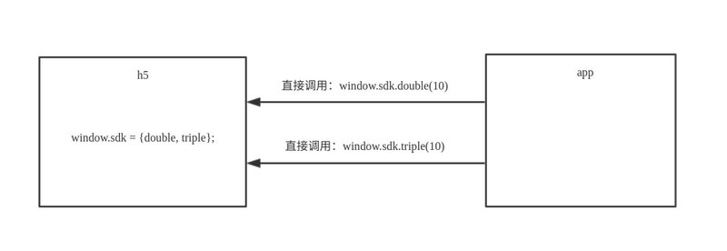

## h5 与原生 app 的交互，本质上说，就是两种调用：
+ app 调用 h5 的代码
+ h5 调用 app 的代码

> app向h5发送信息：调用window下的全局方法并向方法内传参

app 是宿主，可以直接访问 h5，所以这种调用比较简单，就是在 h5 中曝露一些全局对象（包括方法），然后在原生 app 中调用这些对象。

>h5向app发送信息：以url跳转的形式完成，app会拦截h5的链接跳转，当监测到特定的url时，即触发h5与app的交互，如window.loacation.href = 'http://appName.local.com?action=actionName'，action即为app端定义的交互方法名

因为 h5 不能直接访问宿主 app，所以这种调用就相对复杂一点。

这种调用常用有两种方式：
+ 由 app 向 h5 注入一个全局 js 对象，然后在 h5 直接访问这个对象
+ 由 h5 发起一个自定义协议请求，app 拦截这个请求后，再由 app 调用 h5 中的回调函数
>初始化 webview -> 请求页面 -> 下载数据 -> 解析HTML -> 请求 js/css 资源 -> dom 渲染 -> 解析 JS 执行 -> JS 请求数据 -> 解析渲染 -> 下载渲染图