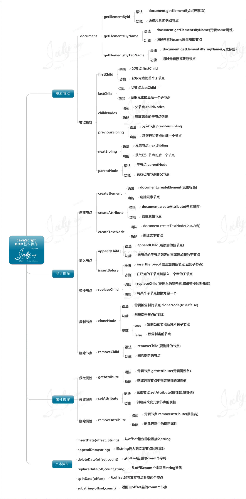

## 图片与文字会有空隙 原理是什么
当img和文字位于同一行中时，img默认是按照文字的基线baseline对齐

原因：将图片识别为文字，默认是基线对齐的，所以会有3px左右的偏差。

如何解决：
+ 使用vertical-align属性，其值取top、bottom、middle都行。只有baseline不行。也就是说让img和文字的顶线、中线、底线对齐都可以清除图片下面的空隙。 通常使用top和middle。
+ 方法二：定义容器里的字体大小为0。`font-size： 0；`
+ 设置img为： `display:block;` 但是不提倡

文字： 顶线top | 中线middle | 基线base | 底线bottom
> https://www.ruanyifeng.com/blog/2015/07/flex-grammar.html?utm_source=tuicool
## Flex 布局
+ 引入弹性盒布局模型的目的是提供一种更加有效的方式来对一个容器中的条目进行排列、对齐和分配空白空间
+ 即便容器中条目的尺寸未知或是动态变化的，弹性盒布局模型也能正常的工作
+ 在该布局模型中，容器会根据布局的需要，调整其中包含的条目的尺寸和顺序来最好地填充所有可用的空间
+ 当容器的尺寸由于屏幕大小或窗口尺寸发生变化时，其中包含的条目也会被动态地调整
+ 比如当容器尺寸变大时，其中包含的条目会被拉伸以占满多余的空白空间
+ 当容器尺寸变小时，条目会被缩小以防止超出容器的范围。弹性盒布局是与方向无关的
+ 在传统的布局方式中，block 布局是把块在垂直方向从上到下依次排列的；而 inline 布局则是在水平方向来排列
+ 弹性盒布局并没有这样内在的方向限制，可以由开发人员自由操作。

> https://www.cnblogs.com/sugartang/p/11342453.html
## DOM的操作

## 行内元素 块级元素
+ 行内元素设置width无效，height无效(可以设置line-height)，margin上下无效，padding上下无效
+ 块级元素可以包含行内元素和块级元素。行内元素不能包含块级元素
+ 行内元素与块级元素直观上的区别
## 为何img、input等内联元素可以设置宽、高
替换元素就是浏览器根据元素的标签和属性，来决定元素的具体显示内容。
## `querySelectorAll`
+ `querySelectorAll()` 方法返回文档中匹配指定 CSS 选择器的所有元素，返回 NodeList 对象。
+ `NodeList` 对象表示节点的集合。可以通过索引访问，索引值从 0 开始。
## svg与canvas画布的区别
https://blog.csdn.net/qq_42098849/article/details/104730475
## 字体大小自适应容器宽度
+ 通过计算原有font-size下文案所撑起的宽度，
+ 除以容器宽度（这里设定容器宽度为屏幕宽度），
+ 得出需要缩放的系数，将系数换算成百分比赋值给font-size即可。
1. 方向一 动态计算字体大小
```html
<div class="hd hd1">
    <span class="hd-text">这个标题很长哦可能一行放不下的怎么办呢</span>
</div>
<script>
    var hdWidth = document.body.getBoundingClientRect().width;
    var textWidth = document.getElementsByClassName('hd-text')[0].offsetWidth;
    var scale = hdWidth / textWidth;
    document.getElementsByClassName('hd-text')[0].style.fontSize = scale * 100 + '%';
</script>
```
2. 方向二 缩放容器
+ 该方案类似方案一，只是缩放的不是font-size，而是通过缩放容器。
+ 使用transform的scale或zoom，其中transform的scale需要设定transform-origin: 0 0;且只对block元素有效（inline-block也有效）
```html
<div class="hd">
    <span class="hd-text">这个标题很长哦可能一行放不下的怎么办呢</span>
</div>
<script>
    var hdWidth = document.body.getBoundingClientRect().width;
    var textWidth = document.getElementsByClassName('hd-text')[0].offsetWidth;
    var scale = hdWidth / textWidth;
    document.getElementsByClassName('hd-text')[0].style.zoom = scale;
</script>
```
## <h1>-<h6>标签怎么合理使用
+ 一个页面建议只用一个H1

## z-index失效
### 失效的情况:
+ 1、父标签 position属性为relative；
+ 2、问题标签无position属性（不包括static）；
+ 3、问题标签含有浮动(float)属性。
+ 4、问题标签的祖先标签的z-index值比较小
### 解决方法:
+ 第一种:position:relative改为position:absolute；
+ 第二种:浮动元素添加position属性（如relative，absolute等）；
+ 第三种:去除浮动。
+ 第四种:提高父标签的z-index值
## input事件自动获取焦点
只要在该input标签后添加`autofocus="autofocus"`即可
```html
<input type="text" id="box" autofocus="autofocus">
```
+ input输入框的onchange事件，要在 input 失去焦点的时候才会触发；
+ 在输入框内容变化的时候不会触发change，当鼠标在其他地方点一下才会触发；
+ onchange 事件也可用于单选框与复选框改变后触发的事件。
