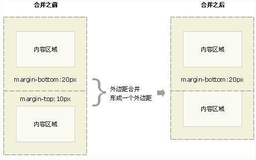

CSS三大特性—— 继承、 优先级和层叠
+ 继承：即子类元素继承父类的样式;
+ 优先级：是指不同类别样式的权重比较;
+ 层叠：是说当数量相同时，通过层叠(后者覆盖前者)的样式。

> 链接：https://segmentfault.com/a/1190000014833437?utm_source=sf-related
## 选择器与优先级
###一、元素选择符
+ 通配选择符(*):选择所有元素
+ 类型选择符(E)：以文档对象类型作为选择符
+ id选择符(E#id):以唯一标识符id属性等于id的E对象作为选择符
+ class选择符(E.class):以class属性包含class的E对象作为选择符
### 二、关系选择符
+ 包含选择符(E F):选择所有被E元素包含的F元素
+ 子选择符(E>F):选择所有作为E元素的子元素F。
+ 相邻选择符(E+F):选择紧贴再E元素之后F元素。
+ 兄弟选择符(E~F):选择E元素后面的所有兄弟元素F。
### 三、属性选择符
```css

```
### 四、伪类选择符
```css
:link, :visited, :hover, :active
```
### 五、伪元素选择符 
```css
/*可以在元素的内容前面插入新内容，一般配合“content”使用*/
::after,
::before, 
::selection, /* 用来改变浏览网页选中文的默认效果 */
/* 伪元素只能用于块级元素 */
::first-letter, /*用于向文本的首字母设置特殊样式，不过这个主要运用于段落排版上多，比如说首字下沉*/
::first-line /* 伪元素用于向文本的首行设置特殊样式 */
```
### 优先级：
+ !important：权重为无穷。
+ 内联style属性：权重为1，0，0，0。
+ ID选择符：权重为0，1，0，0。
+ 类选择符（class）、伪类、属性选择符：权重,0, 0, 1，0。
+ 标签（元素）选择符、伪元素：权重为0, 0, 0，1。
+ 通配选择符（*）关系选择符（+, >, ~, ' ', ||）和 否定伪类（:not()）对优先级没有影响。（但是，在 :not() 内部声明的选择器会影响优先级）0, 0, 0, 0,。
+ 继承
 总结排序：!important > 行内样式 >ID选择器 > 类选择器 > 标签 > 通配符 > 继承 > 浏览器默认属性
 
 ## 定位
+ **static** 默认值，没有定位，元素出现在正常的流中。
+ **absolute**：生成绝对定位的元素，相对于 static 定位以外的第一个父元素进行定位。
    - 绝对定位的元素的位置相对于最近的已定位父元素，如果元素没有已定位的父元素，那么它的位置相对于`<html>`
    - absolute 定位使元素的位置与文档流无关，因此不占据空间。
    - absolute 定位的元素和其他元素重叠。
+ **relative**：生成相对定位的元素，相对于其正常位置进行定位。
+ **fixed**：生成绝对定位的元素，**相对于浏览器窗口进行定位**, 即使窗口是滚动的它也不会移动。
    + Fixed定位使元素的位置与文档流无关，因此不占据空间。
    + Fixed定位的元素和其他元素重叠。
+ **sticky**: 基于用户的滚动位置来定位
    + 粘性定位的元素是依赖于用户的滚动，在 position:relative 与 position:fixed 定位之间切换
    + 它的行为就像 position:relative; 而当页面滚动超出目标区域时，它的表现就像 position:fixed;，它会固定在目标位置
    + 元素定位表现为在跨越特定阈值前为相对定位，之后为固定定位
+ inherit：规定应该从父元素继承 position 属性的值。
+ z-index 属性只能被应用与定位元素上
## 浮动
+ 1.额外标签法：使用clear:both清除浮动
+ 2.父级添加overflow属性
+ 3.利用伪元素clearfix来清除浮
```css
.clearfix:after{/*伪元素是行内元素 正常浏览器清除浮动方法*/
	content: "";
	display: block;
	height: 0;
	clear:both;
	visibility: hidden;
}
.clearfix{
	*zoom: 1;/*ie6清除浮动的方式 *号只有IE6-IE7执行，其他浏览器不执行*/
}
```
+ 4.双伪元素方法的使用
```css
.clearfix:after,.clearfix:before{
    content: "";
    display: table;
}
.clearfix:after{
    clear: both;
}
.clearfix{
    *zoom: 1;
}
```
+ 5 设置容器元素高度height，只适合高度固定的布局

+ 6 容器元素也设置浮动。不推荐，会产生新的浮动问题
## 长度单位
+ 对于只需要适配少部分手机设备，且分辨率对页面影响不大的，使用px即可 。
+ 对于需要适配各种移动设备，使用rem，
>任意浏览器的默认字体高都是16px 所有未经调整的浏览器都符合: 1em=16px。那么12px=0.75em,10px=0.625em 

>为了简化font-size的换算，需要在css中的body选择器中声明Font-size=62.5%，这就使em值变为 16px*62.5%=10px
+ px  像素，对于普通的屏幕，通常是一个设备像素 
+ em  以当前字体的高度为基准的倍数，受父元素的影响。如：当前为12px；则1em = 12px
    + em是相对长度单位。相对于当前对象内文本的字体尺寸。如当前对行内文本的字体尺寸未被人为设置，则相对于浏览器的默认字体尺寸。
    + em特点：
        1. em的值并不是固定的；
        2. em会继承父级元素的字体大小。
+ **rem** 以html文档的字体高度为基准的倍数，如：html { font-size: 16px; }, 则 1rem = 16px,多用于媒体查询，做移动端适配
    + 区别在于使用rem为元素设定字体大小时，仍然是相对大小，但相对的只是HTML根元素
+ vw  视口的初始包含块的宽度的 1%，简单说就是100vw = 1个视口的宽度
+ vh  视口的初始包含块的高度的 1%，简单说就是100vh = 1个视口的高度

>链接; https://segmentfault.com/a/1190000013069516
## 盒子模型
盒子模型是由content（内容）、padding（内边距）、border（边框）和margin（外边距）组成的抽象模型
+ IE模型元素宽度width=content+padding+border，高度计算相同
+ 标准模型元素宽度width=content，高度计算相同 
+ 通过css3新增的属性 box-sizing: content-box | border-box分别设置盒模型为标准模型（content-box）和IE模型（border-box）。
```css
/* 标准模型 */
{box-sizing:content-box;}
 /*IE模型*/
{box-sizing:border-box;}
```
## javascript如何设置获取盒模型对应的宽和高
+ dom.style.width/height 只能取到行内样式的宽和高，style标签中和link外链的样式取不到。
+ dom.currentStyle.width/height 取到的是最终渲染后的宽和高，只有IE支持此属性。
+ window.getComputedStyle(dom).width/height 同（2）但是多浏览器支持，IE9以上支持。
+ dom.getBoundingClientRect().width/height 也是得到渲染后的宽和高，大多浏览器支持。IE9以上支持，除此外还可以取到相对于视窗的上下左右的距离
## 外边距重叠（Box垂直方向的距离由margin决定）

+ 左右横排的盒子之间的间距是两者的外边距相加
+ 当两个垂直外边距相遇时，他们将形成一个外边距，合并后的外边距高度等于两个发生合并的外边距的高度中的较大者。
+ **注意**：只有普通文档流中块框的垂直外边距才会发生外边距合并，行内框、浮动框或绝对定位之间的外边距不会合并。
## BFC(BFC内的外边距不与外部的外边距发生重叠)
BFC(Block Formatting Context)：块级格式化上下文
### 如何创建BFC
1. body 根元素(html)
2. overflow不为visible;
3. float的值不为none；
4. position的值不为static或relative；
5. display属性为inline-blocks,table,table-cell,table-caption,flex,inline-flex;
## 定位布局规则 / BFC的原理（渲染规则）
1. 内部的 Box 会在垂直方向上一个接一个放置。
2. Box 垂直方向的距离由 margin 决定（按照最大margin值设置），属于同一个 BFC 的两个相邻 Box 的 margin 会发生重叠。<br/>
BFC元素垂直方向的边距会发生重叠。属于不同BFC外边距不会发生重叠
3. 每个元素的 margin box 的左边，与包含块 border box 的左边相接触。
4. BFC 的区域不会与 float 元素 重叠。
5. BFC 是页面上的一个隔离的独立容器，容器里面的子元素不会影响到外面的元素。
6. 计算 BFC 的高度时，浮动元素也会参与计算(清除浮动)。
### BFC的作用
1. 防止垂直，避免margin重叠。
2. 自适应两栏布局。
3. 清除浮动。
 
 BFC就是页面上的一个隔离的独立容器，容器里面的子元素不会影响到外面的元素。反之也如此。
 ## 重绘重排（耗时、导致浏览器卡顿）
 + 重绘（repeat）是指一个元素外观的改变所触发的浏览器行为，浏览器会根据元素的新属性重新绘制，使元素呈现新的外
 观。
 + 重排(重构/回流/reflow) :当渲染树中的一部分(或全部)因为元素的规模尺寸，布局，隐藏等改变而需要重新
   构建,这就称为洄流(reflow)。每个页面至少需要一次回流， 就是在页面第一次 加载的时候
 ### 触发重绘的条件:改变元素外观属性。
 如: color, background-color等
 ### 触发重排的条件:任何页面布局和几何属性的改变都会触发重排，比如:
1. 页面渲染初始化; (无法避免) 
2. 添加或删除可见的DOM元素;
3. 元素位置的改变，或者使用动画;
4. 元素尺寸的改变--大小， 外边距，边框;
5. 浏览器窗口尺寸的变化(resize 事件发生时) ;
6. 填充内容的改变，比如文本的改变或图片大小改变而引起的计算值宽度和高度的改变;
7. 读取某些元素属性: ( offsetLeft/Top/Height/Width，clientTop/Left/Width/Height,
  scrollTop/Left/Width/Height，width/height, getComputedStyle()， currentStyle(IE) )

