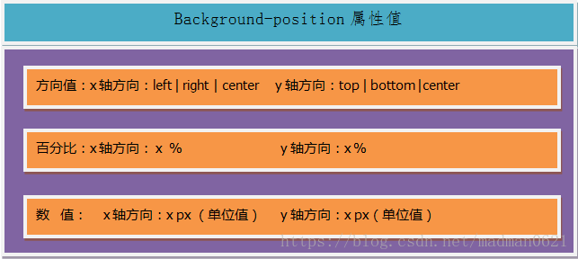

CSS 三大特性—— 继承、 优先级和层叠

- 继承：即子类元素继承父类的样式;
- 优先级：是指不同类别样式的权重比较;
- 层叠：是说当数量相同时，通过层叠(后者覆盖前者)的样式。

> 链接：https://segmentfault.com/a/1190000014833437?utm_source=sf-related

## 选择器与优先级

###一、元素选择符

- 通配选择符(\*):选择所有元素
- 类型选择符(E)：以文档对象类型作为选择符
- id 选择符(E#id):以唯一标识符 id 属性等于 id 的 E 对象作为选择符
- class 选择符(E.class):以 class 属性包含 class 的 E 对象作为选择符

### 二、关系选择符

- 包含选择符(E F):选择所有被 E 元素包含的 F 元素
- 子选择符(E>F):选择所有作为 E 元素的子元素 F。
- 相邻选择符(E+F):选择紧贴再 E 元素之后 F 元素。
- 兄弟选择符(E~F):选择 E 元素后面的所有兄弟元素 F。

### 三、属性选择符

```css

```

### 四、伪类选择符

```css
:link, :visited, :hover, :active
```

### 五、伪元素选择符

```css
/*可以在元素的内容前面插入新内容，一般配合“content”使用*/
::after,
::before,
::selection, /* 用来改变浏览网页选中文的默认效果 */
/* 伪元素只能用于块级元素 */
::first-letter, /*用于向文本的首字母设置特殊样式，不过这个主要运用于段落排版上多，比如说首字下沉*/
::first-line /* 伪元素用于向文本的首行设置特殊样式 */
```

### 优先级：

- !important：权重为无穷。
- 内联 style 属性：权重为 1，0，0，0。
- ID 选择符：权重为 0，1，0，0。
- 类选择符（class）、伪类、属性选择符：权重,0, 0, 1，0。
- 标签（元素）选择符、伪元素：权重为 0, 0, 0，1。
- 通配选择符（\*）关系选择符（+, >, ~, ' ', ||）和 否定伪类（:not()）对优先级没有影响。（但是，在 :not() 内部声明的选择器会影响优先级）0, 0, 0, 0,。
- 继承
  总结排序：!important > 行内样式 >ID 选择器 > 类选择器 > 标签 > 通配符 > 继承 > 浏览器默认属性

## 定位

- **static** 默认值，没有定位，元素出现在正常的流中。
- **absolute**：生成绝对定位的元素，相对于 static 定位以外的第一个父元素进行定位。
  - 绝对定位的元素的位置相对于最近的已定位父元素，如果元素没有已定位的父元素，那么它的位置相对于`<html>`
  - absolute 定位使元素的位置与文档流无关，因此不占据空间。
  - absolute 定位的元素和其他元素重叠。
- **relative**：生成相对定位的元素，相对于其正常位置进行定位。
- **fixed**：生成绝对定位的元素，**相对于浏览器窗口进行定位**, 即使窗口是滚动的它也不会移动。
  - Fixed 定位使元素的位置与文档流无关，因此不占据空间。
  - Fixed 定位的元素和其他元素重叠。
- **sticky**: 基于用户的滚动位置来定位
  - 粘性定位的元素是依赖于用户的滚动，在 position:relative 与 position:fixed 定位之间切换
  - 它的行为就像 position:relative; 而当页面滚动超出目标区域时，它的表现就像 position:fixed;，它会固定在目标位置
  - 元素定位表现为在跨越特定阈值前为相对定位，之后为固定定位
- inherit：规定应该从父元素继承 position 属性的值。
- z-index 属性只能被应用与定位元素上

## 浮动

- 1.额外标签法：使用 clear:both 清除浮动
- 2.父级添加 overflow 属性
- 3.利用伪元素 clearfix 来清除浮

```css
.clearfix:after {
  /*伪元素是行内元素 正常浏览器清除浮动方法*/
  content: '';
  display: block;
  height: 0;
  clear: both;
  visibility: hidden;
}
.clearfix {
  *zoom: 1; /*ie6清除浮动的方式 *号只有IE6-IE7执行，其他浏览器不执行*/
}
```

- 4.双伪元素方法的使用

```css
.clearfix:after,
.clearfix:before {
  content: '';
  display: table;
}
.clearfix:after {
  clear: both;
}
.clearfix {
  *zoom: 1;
}
```

- 5 设置容器元素高度 height，只适合高度固定的布局

- 6 容器元素也设置浮动。不推荐，会产生新的浮动问题

## 长度单位

- 对于只需要适配少部分手机设备，且分辨率对页面影响不大的，使用 px 即可 。
- 对于需要适配各种移动设备，使用 rem，
  > 任意浏览器的默认字体高都是 16px 所有未经调整的浏览器都符合: 1em=16px。那么 12px=0.75em,10px=0.625em

> 为了简化 font-size 的换算，需要在 css 中的 body 选择器中声明 Font-size=62.5%，这就使 em 值变为 16px\*62.5%=10px

- px 像素，对于普通的屏幕，通常是一个设备像素
- em 以当前字体的高度为基准的倍数，受父元素的影响。如：当前为 12px；则 1em = 12px
  - em 是相对长度单位。相对于当前对象内文本的字体尺寸。如当前对行内文本的字体尺寸未被人为设置，则相对于浏览器的默认字体尺寸。
  - em 特点：
    1. em 的值并不是固定的；
    2. em 会继承父级元素的字体大小。
- **rem** 以 html 文档的字体高度为基准的倍数，如：html { font-size: 16px; }, 则 1rem = 16px,多用于媒体查询，做移动端适配
  - 区别在于使用 rem 为元素设定字体大小时，仍然是相对大小，但相对的只是 HTML 根元素
- vw 视口的初始包含块的宽度的 1%，简单说就是 100vw = 1 个视口的宽度
- vh 视口的初始包含块的高度的 1%，简单说就是 100vh = 1 个视口的高度

> 链接; https://segmentfault.com/a/1190000013069516

## 盒子模型

盒子模型是由 content（内容）、padding（内边距）、border（边框）和 margin（外边距）组成的抽象模型

- IE 模型元素宽度 width=content+padding+border，高度计算相同
- 标准模型元素宽度 width=content，高度计算相同
- 通过 css3 新增的属性 box-sizing: content-box | border-box 分别设置盒模型为标准模型（content-box）和 IE 模型（border-box）。

```css
/* 标准模型 */
 {
  box-sizing: content-box;
}
/*IE模型*/
 {
  box-sizing: border-box;
}
```

## javascript 如何设置获取盒模型对应的宽和高

- dom.style.width/height 只能取到行内样式的宽和高，style 标签中和 link 外链的样式取不到。
- dom.currentStyle.width/height 取到的是最终渲染后的宽和高，只有 IE 支持此属性。
- window.getComputedStyle(dom).width/height 同（2）但是多浏览器支持，IE9 以上支持。
- dom.getBoundingClientRect().width/height 也是得到渲染后的宽和高，大多浏览器支持。IE9 以上支持，除此外还可以取到相对于视窗的上下左右的距离

## 外边距重叠（Box 垂直方向的距离由 margin 决定）


- 左右横排的盒子之间的间距是两者的外边距相加
- 当两个垂直外边距相遇时，他们将形成一个外边距，合并后的外边距高度等于两个发生合并的外边距的高度中的较大者。
- **注意**：只有普通文档流中块框的垂直外边距才会发生外边距合并，行内框、浮动框或绝对定位之间的外边距不会合并。

## BFC (BFC 内的外边距不与外部的外边距发生重叠)

BFC(Block Formatting Context)：块级格式化上下文

### 如何创建 BFC

1. body 根元素(html)
2. overflow 不为 visible;
3. float 的值不为 none；
4. position 的值不为 static 或 relative；
5. display 属性为 inline-block,table,table-cell,table-caption,flex,inline-flex;

## 定位布局规则 / BFC 的原理（渲染规则）

1. 内部的 Box 会在垂直方向上一个接一个放置。
2. Box 垂直方向的距离由 margin 决定（按照最大 margin 值设置），属于同一个 BFC 的两个相邻 Box 的 margin 会发生重叠。<br/>
   BFC 元素垂直方向的边距会发生重叠。属于不同 BFC 外边距不会发生重叠
3. 每个元素的 margin box 的左边，与包含块 border box 的左边相接触。
4. BFC 的区域不会与 float 元素 重叠。
5. BFC 是页面上的一个隔离的独立容器，容器里面的子元素不会影响到外面的元素。
6. 计算 BFC 的高度时，浮动元素也会参与计算(清除浮动)。

### BFC 的作用

1. 防止垂直，避免 margin 重叠。
2. 自适应两栏布局。
3. 清除浮动。

BFC 就是页面上的一个隔离的独立容器，容器里面的子元素不会影响到外面的元素。反之也如此。

## 重绘重排（耗时、导致浏览器卡顿）

- 重绘（repeat）是指一个元素外观的改变所触发的浏览器行为，浏览器会根据元素的新属性重新绘制，使元素呈现新的外
  观。
- 重排(重构/回流/reflow) :当渲染树中的一部分(或全部)因为元素的规模尺寸，布局，隐藏等改变而需要重新
  构建,这就称为洄流(reflow)。每个页面至少需要一次回流， 就是在页面第一次 加载的时候

### 触发重绘的条件:改变元素外观属性。

如: color, background-color 等

### 触发重排的条件:任何页面布局和几何属性的改变都会触发重排，比如:

1. 页面渲染初始化; (无法避免)
2. 添加或删除可见的 DOM 元素;
3. 元素位置的改变，或者使用动画;
4. 元素尺寸的改变--大小， 外边距，边框;
5. 浏览器窗口尺寸的变化(resize 事件发生时) ;
6. 填充内容的改变，比如文本的改变或图片大小改变而引起的计算值宽度和高度的改变;
7. 读取某些元素属性: ( offsetLeft/Top/Height/Width，clientTop/Left/Width/Height,
   scrollTop/Left/Width/Height，width/height, getComputedStyle()， currentStyle(IE) )

## 重排重绘

> http://blog.csdn.net/qq_42098849/article/details/105432195

## 高度塌陷以及解决方法

1. 父元素的高度写死 不推荐
2. 可以直接在高度塌陷的父元素的最后，添加一个空白的 div 不推荐
3. 通过 after 伪类来选中父元素的后面

```css
.clear-fix:after {
  content: '';
  display: block;
  height: 0;
  clear: both;
  overflow: hidden;
  visibility: hidden;
}
```

### 开启 BFC 属性

- BFC 的区域不会与 float 元素 重叠
- 开启 BFC 的元素可以包含浮动的子元素
- 父元素的垂直外边距不会和子元素重叠

## background-position 和雪碧图(CSS Sprites)用法

为了减少 http 请求数，会将大量的图片图片合成一张雪碧图（Sprite）来使用。
雪碧图的使用就是通过控制 background-position 属性值来确定图片呈现的位置

### background-position

- background-position 属性设置背景图像的起始位置
- background-position：x | y，用法上可以对其一个属性单独使用 background-position-x 和 background-position-y
  
  background-position 属性的作用：设置背景图像的起始位置
- 起始位置是相对于自身容器而言
- 数值 background-position：100px 50px 意味着图片在距离自身容器 x 轴为 100px、y 轴为 50px 的位置作为图片显示的起点位置
- 百分比 以自身容器的长宽 减去 图片的长宽 乘以 百分比 所得的数值来确定图片的起始位置
  - 例如：background-position：50% 50%
    > 公式：
    > （容器自身的宽度/高度 - 图片自身的宽度/高度） x 百分比

提示：

- background-position 属性值如果是数值，那么指相对于容器自身数值的距离作为起始位置；
- 如果是百分比或者是方向，那么指的是相对于容器自身（容器自身的宽度/高度 - 图片自身的宽度/高度） x 百分比 所得的数值作为起始位置
- 如果不设置 background-position 属性值，那么默认起始位置为 background-position：0% 0%
- 方向值和百分比的计算方式是一样的，它们可以相互转换，left：0%，right：100%，center：50%
- 如果 background-position 属性值只设置一个，那么另一个默认为 center

### 二、雪碧图

CSS 雪碧图即 CSS Sprites 是一种 CSS 图像合并技术
将小图标和背景图像合并到一张图片上，然后利用 CSS 的背景定位来显示需要显示的图片部分

#### 为什么使用雪碧图时 background-position 属性值为负数

始终记住一个概念，background-position 设置的是雪碧图相对于盒子的起始位置

#### 为什么要使用雪碧图

网站开发 90%会用到小图标， 多小图标调用显示是前端开发常见的问题
如果每个小图标都单独调用一张图片， 即意味着每个小图标的显示都产生一个 HTTP 请求；
每个请求都需要一定的性能开销，主要在请求、以及响应阶段。
为了减少 http 请求数量，加速网页内容显示，很多网站的导航栏图标、登录框图片等，使用的并不是<image>标签，而是 CSS Sprite 雪碧图。

#### 使用雪碧图的优点有以下几点：

- 通过将多张图片合并成一张，可以有效减少 HTTP 请求，提高页面加载的性能
- 将多张图片合并到一张图片中，可以减小图片的总大小
- 整理起来更为方便，同一个按钮不同状态的图片也不需要一个个切割出来并个别命名
- 只需要修改一张或少张图片的颜色或样式来改变整个网页的风格
- 只需对一张集合的图片命名，不需要对每一个小图片进行命名，从而提高了网页制作效率
- 图片变成一张肯定所占位置更少，减少加载时间，增强用户体验

缺点

- 合成起来麻烦
- 适应性差
- 可维护性差
- 背景大小，容易出现断裂，相比之下不是直接替换照片，而是利用 PS 来测量好每一个的位置，环节繁琐一些，当然更改部分元素的同时需要动整体，也比较麻烦一些
- 小图标在高清屏幕上可能会失真，另外频繁使用定位会占用比较多的 CPU

图片拼合技术适用于网页上图标相对不会变动的情况下，像经常会用于更新更改的区域，更换图片等等的并不建议使用。

background-attachment 属性必须设置为 "fixed"

#### 背景吸附 background-attachment：fixed

## Bootstrap 响应式布局原理

- 响应式布局，主要是为移动端提出的
- 通过 CSS3 Media Queries（媒体（设备）查询）
- Bootstrap 主要用到 min-width、max-width，以及 and 语法，用于在不同的分辨率下设置不同的 CSS 样式。
- Bootstrap 响应式布局是利用其栅格系统，对于不同的屏幕采用不同的类属性
- 通过定义容器大小,平分 12 份(最多)再调整内外边距，最后结合媒体查询，就制作出了强大的响应式网格系统

## `display:none` `visibility:hidden` `opacity:0` 区别

### display: none;

- DOM 结构：浏览器不会渲染 display 属性为 none 的元素，不占据空间；
- 事件监听：无法进行 DOM 事件监听；
- 性能：动态改变此属性时会引起重排，性能较差；
- 继承：不会被子元素继承，毕竟子类也不会被渲染；
- transition：transition 不支持 display。

### visibility: hidden;

- DOM 结构：元素被隐藏，但是会被渲染不会消失，占据空间；
- 事件监听：无法进行 DOM 事件监听；
- 性 能：动态改变此属性时会引起重绘，性能较高；
- 继 承：会被子元素继承，子元素可以通过设置 visibility: visible; 来取消隐藏；
- transition：visibility 会立即显示，隐藏时会延时

### opacity: 0;

- DOM 结构：透明度为 100%，元素隐藏，占据空间；
- 事件监听：可以进行 DOM 事件监听；
- 性 能：提升为合成层，不会触发重绘，性能较高；
- 继 承：会被子元素继承,且，子元素并不能通过 opacity: 1 来取消隐藏；
- transition：opacity 可以延时显示和隐藏

## 在页面中隐藏一个元素的几种方法

1. display:none，不占据空间，无法点击；
2. visibility:hidden，占据空间，无法点击；
3. height:0; overflow:hidden，不占据空间，无法点击；
4. position:absolute; top:-999em，不占据空间，无法点击；
5. opacity: 0; filter:Alpha(opacity=0)，占据空间，可以点击；
6. position: absolute; visibility: hidden， 不占据空间，无法点击。

## Sass 和 Less 的区别

- 变量符不一样，less 是@，而 Scss 是$，而且变量的作用域也不一样
- 输出设置，Less 没有输出设置，Sass 提供 4 中输出选项：nested, compact, compressed 和 expanded。
- Sass 支持条件语句，可以使用 if{}else{},for{}循环等等。而 Less 不支持。
- Sass 是基于 Ruby 的，是在服务端处理的，
- 而 Less 是需要引入 less.js 来处理 Less 代码输出 css 到浏览器，
- 也可以在开发环节使用 Less，然后编译成 Css 文件，直接放到项目中，
- 也有`Less.app`、`SimpleLess`、`CodeKit.app`这样的工具，也有在线编译地址。

## 动画实现方式 ？一段流畅的动画帧与帧之间间隔有什么要求？

- html5 动画，js 动画，CSS3 动画
- 多数情况下最高的绘制频率只能是每秒 60 帧
- 对应于显示器的 60Hz
  - 低于这个频率，肉眼感觉画面卡顿不流畅
  - 高于这个频率，及其耗费性能
- 通常采用的时间间隔就是 1/60,也就是 16.7ms

## css3 实现 0.5px 的细线？

```css
/* css */
.line {
    position: relative;
}
.line:after {
    content: "";
    position: absolute;
    left: 0;
    top: 0;
    width: 100%;
    height: 1px;
    background-color: #000000;
    -webkit-transform: scaleY(.5);
    transform: scaleY(.5);
}

/* html */
<div class="line"></div>
```

在 padding 和 margin 设置为百分比的时候，不管是 top/left/right/bottom ,这个百分比都是相对于父元素的宽度来取值的
