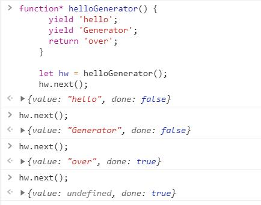

Javascript语言的执行环境是"单线程"（就是指一次只能完成一件任务。如果有多个任务，就必须排队，前面一个任务完成，再执行后面一个任务，以此类推）
## 一、回调函数（callback）
回调是一个函数被作为一个参数传递到另一个函数里，在那个函数执行完后再执行。
（也即：B函数被作为参数传递到A函数里，在A函数执行完后再执行B）

假定有两个函数f1和f2，后者等待前者的执行结果。
如果f1是一个很耗时的任务，可以考虑改写f1，把f2写成f1的回调函数。
```js
function f1(callback){
　　setTimeout(function () {
　　　　// f1的任务代码
　　　　callback();
　　}, 1000);
}
// 执行
f1(f2)
setTimeout(() => {
console.log(1);
}, 10)
setTimeout(() => {
console.log(1);
}, 0)
```

回调函数是异步编程最基本的方法，其优点是简单、容易理解和部署，
缺点是不利于代码的阅读和维护，各个部分之间高度耦合（Coupling），流程会很混乱，
而且每个任务只能指定一个回调函数。

注意 区分 回调函数和异步: 回调并不一定就是异步。他们自己并没有直接关系。

## Promise 对象
## Generator 函数
 Generator 函数是 ES6 提供的一种异步编程解决方案，语法行为与传统函数完全不同
 ```js
function* helloGenerator() {
      yield 'hello';
      yield 'Generator';
      return 'over';
    }
    
    let hw = helloGenerator();
    hw.next(); //{value:"hello",done:false}
    hw.next(); //{value:"Generator",done:false}
    hw.next(); //{value:"over",done:true}
    hw.next(); //{value:undefined,done:true}
```


+ next方法的作用是分阶段执行Generator函数。
+ 每次调用next方法，会返回一个对象，表示当前阶段的信息（value属性和done属性）
+ value属性是yield语句后面表达式的值，表示当前阶段的值；
+ done属性是一个布尔值，表示Generator函数是否执行完毕，即是否还有下一个阶段。

特征：
+ 一是，function关键字与函数名之间有一个星号；
+ 二是，函数体内部使用yield表达式，定义不同的内部状态；
+ 三是，通过next方法获取每段状态的返回结果,上面分成4次执行了Generator函数
    + 第一次，获取第一个yield函数的返回结果并暂停，done:false，代表函数内的状态还没有执行结束；
    + 第二次，同理；第三次，获取return 的返回结果，done:true表示函数内的状态已经执行完毕；
    + 第四次，函数内已经没有可以执行的状态，所有返回undefined，同时告诉函数内的状态已经执行完毕；
    + 如果函数内没有return，在第三次时返回undefined，done:true表示函数内的状态已经执行完毕
    
 ```js
function* foo() {
  yield 1;
  yield 2;
  yield 3;
  yield 4;
  yield 5;
  return 6;
}

for (let v of foo()) {
  console.log(v);
}
// 1 2 3 4 5
```
上面代码使用for...of循环，依次显示 5 个yield表达式的值。
这里需要注意，一旦next方法的返回对象的done属性为true，for...of循环就会中止，且不包含该返回对象，
所以上面代码的return语句返回的6，不包括在for...of循环之中。