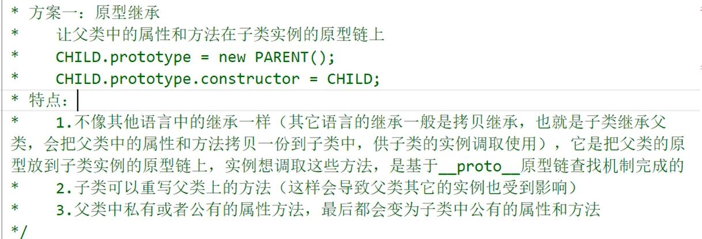

## 什么是面向对象（OOP）

- 面向对象是把事务分解成为一个个对象，然后由对象之间分工与合作
- 面向对象编程具有灵活、代码可复用、容易维护和开发的优点，更适合多人合作的大型软件项目

## 类的继承封装多态

- 封装： 高内聚低耦合 把实现功能的函数写成方法
- 多态： 重载和重写
  - 重载：方法名相同，形参个数/类型不一样（JS 不存在真正意义上的重载）
  - 重写：在类的继承中， 子类可以重写父类中的方法
- 继承： 子类继承父类上的属性和方法（目的是让子类的实例享有父类的属性和方法）
- 为什么要继承？

https://blog.csdn.net/weixin_45284354/article/details/112485716

### 方法一：原型链继承

- 父类中的属性和方法在子类实例的原型链上
- 关键： 子类型的原型为父类型的一个实例对象
- **children.prototype = new parent()**
- **children.prototype.constructor = children**

步骤（套路）：

1. 定义父类型构造函数
2. 给父类型的原型添加方法
3. 定义子类型的构造函数
4. 继承父类型：**子类型的原型为父类型的一个实例对象**（关键）
5. 让子类型的原型的 constructor 指向子类型
6. 给子类型的原型添加方法
7. 创建子类型的对象: 可以调用父类型的方法

特点：

- 父类中私有或者公有的属性/方法，最后会变为子类公有的属性/方法
- 子类可以重写父类的方法（ ==> 会导致父类的其他实例也受到影响）
- 在创建子类的实例时，不能向父类的构造函数中传递参数
- 继承单一， 无法实现多继承
  

### 方法二：借用构造函数继承（假的/伪造对象/经典继承）

关键：在子类型构造函数中通用 call()调用父类型构造函数

步骤（套路）：

- 定义父类型构造函数
- 定义子类型构造函数
- 在子类型构造函数中调用父类型构造

特点：

- 解决子类构造函数向父类构造函数中传递参数
- 可以实现多继承（call 或者 apply 多个父类）
- 父类的私有属性继承为子类的私有属性
  只继承父类构造函数的属性/方法，未继承父类原型上的属性/方法
- 方法都在构造函数中定义，无法实现复用， 每次都需要重新调用
- 每个子类都有父类构造函数的副本

### 方法三：组合继承（原型链+借用构造函数组合继承）

- 将原型链继承和构造函数结合起来，从而发挥二者之长的一种模式
- 思路: 使用原型链实现对原型属性和方法的继承，而通过借用构造函数来实现对实例属性的继承。
- 调用了两次父类构造函数

### 方法四：原型式继承

### 方法五：寄生组合继承

- 寄生：在函数内返回对象然后调用
- 组合：
  - 1、函数的原型等于另一个实例
  - 2、在函数中用 apply 或者 call 引入另一个构造函数，可传参
- 即通过借用构造函数来继承属性，通过原型链的方式来继承方法

### 方法六：Es6 Class 继承

### 方法七：原型式继承

- 利用一个空对象作为中介，将某个对象直接赋值给空对象构造函数的原型。
- 不能做到函数复用
- 共享引用类型属性的值
- 无法传递参数
