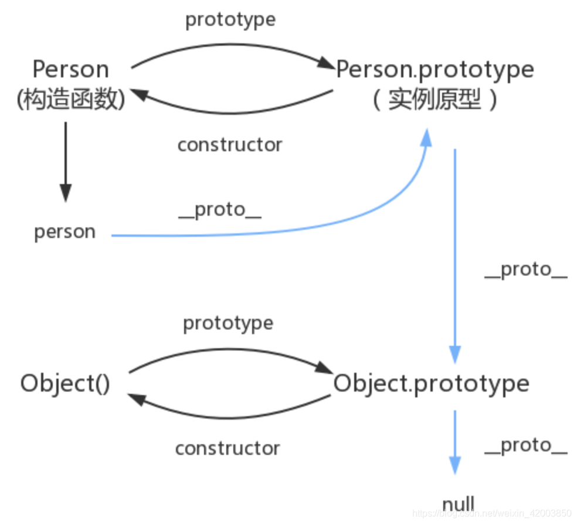

- JavaScript 里任何东西都是对象，任何一个对象内部（null 除外）都有另一个对象叫**proto**，即原型，它可以包含任何东西让对象继承。当然**proto**本身也是一个对象，它自己也有自己的**proto**，这样一级一级向上，就构成了一个**proto**链，即原型链。当然原型链不会无限向上，它有个终点，可以称为原型链的顶端，或者 root，它是一个特殊的对象，它的**proto**为 null。

```js
obj.__proto__.__proto__......__proto__ === null;
```

- 原型链：js 对象独有的**proto**属性，当访问一个对象的属性时，如果该对象内不存在这个属性，会去它的**proto**属性所指向的那个对象（父对象）里找，直到 null
- proto：对象都有私有属性**proto**，从对象指向实例原型
- prototype：函数独有的属性，从一个函数指向一个对象，包含所有实例可共享的属性和方法，任何函数创建时，会默认创建该函数的 prototype 对象
- constructor：实例的构造函数（constructor）属性，指向实例
- 所有函数和对象最终都是由 Function 构造函数得来，所以 constructor 属性的终点就是 Function 这个函数

1. 函数的 prototype 属性
   - 每个函数都有一个 prototype 属性, 它默认指向一个 Object 空对象(即称为: 原型对象)
   - 原型对象中有一个属性 constructor, 它指向函数对象
2. 给原型对象添加属性(一般都是方法)
   - 作用：函数的所有实例对象自动拥有原型中的属性(方法)
3. 每个函数 function 都有一个 prototype，即显式原型(属性)
4. 每个实例对象都有一个**proto**，可称为隐式原型(属性)
5. 对象的隐式原型的值为其对应构造函数的显式原型的值
6. 总结:

- 函数的 prototype 属性: 在定义函数时自动添加的, 默认值是一个空 Object 对象
- 对象的**proto**属性: 创建对象时自动添加的, 默认值为构造函数的 prototype 属性值

1. 读取对象的属性值时: 会自动到原型链中查找
2. 设置对象的属性值时: 不会查找原型链, 如果当前对象中没有此属性, 直接添加此属性并设置其值
3. 方法一般定义在原型中, 属性一般通过构造函数定义在对象本身上
