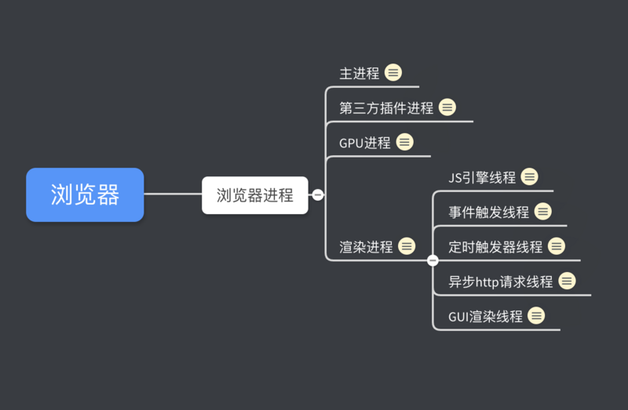

##  JS是一门单线程的非阻塞的脚本语言
>https://segmentfault.com/a/1190000014872028
### 首先区分进程和线程
+ 进程是CPU资源分配的最小单位(是能够拥有资源和独立运行的最小单位)
+ 线程是CPU调度的最小单位
+ 一个进程由一个或多个线程组成
+ 通俗的讲：进程是一个工厂，工厂有它独立的资源，工厂之间相互独立--->进程之间相互独立，线程是工厂中的工人，多个工人之间可以协作完成任务，工厂内有一个或多个工人，工人之间共享空间。

- 工厂的资源 -> 系统分配的内存。
- 工厂之间相互独立 -> 进程之间相互独立，也即进程分配到的内存相互独立，无法读到对方内存中的数据。
- 一个工厂有一个或多个工人 -> 一个进程中有一个或多个线程。
- 多个工人协同完成工作 -> 进程中多个线程协同完成工作。即线程之间能互相发送请求与接收结果。
- 工人共享工作资源 -> 进程中所有线程都能访问到相同一块内存，即信息是互通的。

一个进程就是一个程序的运行实例 启动一个程序的时候，操作系统会为该程序创建一块内存，用来存放代码、运行中的数据和一个执行任务的主线程，我们把这样的一个运行环境叫进程。

#### 浏览器是多进程的
+ Browser进程： 浏览器主进程 只有一个 负责协调主控
    + 负责浏览器界面的显示、与用户交互（如前进、后退等）
    + 负责各个页面的管理，创建和销毁其他进程；
    + 将渲染(Renderer)进程得到的内存中的Bitmap(位图)，绘制到用户界面上
    + 网络资源的管理和下载等
+ 第三方插件进程 每种类型的插件对应一个进程，仅当该插件使用时才创建；
+ GPU进程 最多一个 用于3D绘图等
+ 浏览器渲染进程（render进程）浏览器内核
    + 负责页面的渲染，脚本的执行，事件的处理
    + 每打开一个Tab页，就相当于创建了一个独立的浏览器进程（某些情况下多个tab由于优化策略会合并）
+ 网络进程 主要负责页面的网络资源加载，之前是作为一个模块运行在浏览器进程里面的，直至最近才独立出来，成为一个单独的进程
#### 浏览器多进程的优势
+ 避免单个page crash影响整个浏览器；
+ 避免第三方插件crash影响整个浏览器
+ 多进程充分利用多核优势；
+ 方便使用沙盒模型隔离插件等进程，提高浏览器稳定性
>简单点理解：如果浏览器是单进程，那么某个tab页或第三方插件崩溃了，就会导致整个浏览器崩溃，体验度极差，不过多进程内存消耗会更大，有点用空间换时间。
#### 浏览器的渲染进程是多线程的
+ GUI渲染线程 
    + 负责渲染浏览器界面，解析HTML，CSS，构建DOM树 布局和绘制等
    + 当界面需要重绘（Repaint）或由于某种操作引发回流（reflow）时该线程会执行
    + 注意：GUI渲染线程和JS引擎线程是互斥的，当JS引擎执行时GUI线程会被挂起，GUI更新会保存在一个队列中等JS引擎空闲时立即执行
+ JS引擎线程 也称为JS内核
    + 负责解析Javascript脚本，运行代码 （V8引擎）
    + JS引擎一直等待着任务队列中的任务到来，然后加以处理，一个tab页面（renderer进程）中无论什么时候都只有一个JS线程在运行JS程序；
    + 注意：由于GUI渲染线程和JS引擎线程是互斥的，所以如果JS程序运行时间过长，这样会导致页面渲染不连贯，导致页面渲染加载阻塞
+ 事件触发线程 将对应任务添加到事件线程中，当事件符合触发条件被触发事件触发时才执行
    + 归属于浏览器，而不是JS引擎，用来控制事件循环，并且管理着一个事件队列(task queue)；
    + 当JS引擎执行代码块如setTimeOut时（也可以来自浏览器内核的其他线程，如鼠标单击事件、AJAX异步请求等），会将对应的任务添加到事件线程中
    + 当对应的事件符合触发条件被触发时，该线程就会把事件添加到JS的待处理队列的队尾，等待JS引擎的处理；
    + 注意：由于JS的单线程的关系所以这些待处理队列中的事件都得排队等待JS引擎处理（当JS引擎空闲时才会去执行）
+ 定时触发器线程 
    + setInterval与setTimeout所在线程
    + 浏览器的定时计数器并不是由JavaScript引擎计数的
+ 异步http请求线程 
    + 在XMLHttpRequest在连接后通过浏览器新开一个线程请求
    + 将检测到状态变更时，如果设置有回调函数，异步线程就将产生状态变更事件，将这个回调在放到事件队列中，再由JavaScript引擎执行

>https://juejin.im/post/6844904134307495943

# 解析DOM的这几个大过程：
+ Bytes(字节) -> Characters(字符) -> Tokens(词) -> Nodes(节点) -> DOM(DOM树)
+ 首先，发起请求拿到页面 HTML 内容，这个内容它是0/1这样的原始 字节流
+ 接着，浏览器拿到这些 HTML 的原始字节，根据文件的指定编码 (例如 UTF-8) 将它们转换成各个 字符
+ 现在字节流变成了 字符流 ，也就是一大串字符串
+ 为了把 字符流 解析成正确的 DOM 结构，浏览器还要继续努力
+ 接着进行 词法解析 ，把字符流初步解析成我们可理解的 词，学名叫 token
+ Tokens 这个阶段中会标识出当前 Token 是 开始标签 或是 结束标签 亦或是 文本 等信息
+ 接着在每个 Token 被生成后，会立刻消耗这个 Token 创建出节点对象，就是 节点 (Nodes) 阶段
+ 把开始结束标签配对、属性赋值好、父子关系这些都连接好了，最终就构成了 DOM 

# 解析CSS构建CSSOM树

CSS 字节转换成字符，接着词法解析与法解析，最后构成 CSS对象模型(CSSOM) 的树结构

# 事件循环机制
## 浏览器环境下js引擎的事件循环机制
### 1.执行栈与事件队列
### 2.macro task与micro task

## Node与浏览器的 Event Loop 差异
+ 浏览器环境下，microtask的任务队列是每个macrotask执行完之后执行。
+ 而在Node.js中，microtask会在事件循环的各个阶段之间执行，也就是一个阶段执行完毕，就会去执行microtask队列的任务。
+ Node端，microtask 在事件循环的各个阶段之间执行
+ 浏览器端，microtask 在事件循环的 macrotask 执行完之后执行