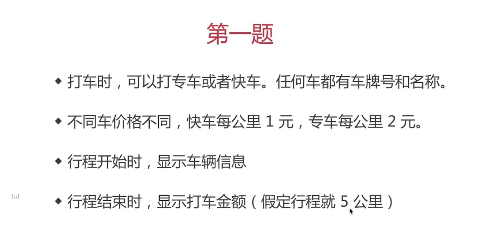

设计模式是一种思想： 最核心的思想——封装变化
+ 设计模式是软件开发人员在软件开发过程中面临的一般问题的解决方案
+ 这些解决方案是众多软件开发人员经过相当长的一段时间的试验和错误总结出来的。
+ 定义：面向对象软件设计过程中针对特定问题的简洁而优雅的解决方案

描述：
+ 按照哪种思路或者标准来实现功能
+ 功能相同，可以有不同设计方案来实现
+ 伴随着需求增加，设计的作用才能体现出来

## SOLID五大设计原则
### S 单一职责原则
+ 一个程序只做好一件事情
+ 如果功能过于复杂就拆分开，每个部分保持独立
### O 开放封闭原则
+ 对扩展开放，对修改封闭
+ 增加需求时，扩展新代码，而非修改已有代码
+ ==> 软件设计终极目标
### L 李氏置换原则
+ 子类能覆盖父类
+ 父类能出现的地方子类就能出现
+ JS中使用较少（弱类型 & 继承使用少）
### I 接口独立原则
+ 保持接口的单一独立，避免出现“胖接口”
+ JS中无接口（TS例外），使用较少
+ 类似于单一职责原则，这里更关注接口
### D 依赖导致原则
+ 面向接口编程，依赖于抽象而不宜懒于具体
+ 使用方法只关注接口而不关注具体类的实现
+ JS中使用较少（无接口&弱类型）

## 从设计到模式
### 创建型
+ 工厂模式（工厂方法模式、抽象工厂模式、建造者模式）
+ 单例模式
+ 原型模式
### 结构型
+ **适配器模式**
+ **装饰器模式**
+ **代理模式**
+ **外观模式**
+ 桥接模式
+ 组合模式
+ 享元模式
### 行为型
+ 策略模式
+ 模板方法模式
+ **观察者模式**
+ **迭代器模式**
+ 职责连模式
+ 命令模式
+ 备忘录模式
+ **状态模式**
+ 访问者模式
+ 中介者模式
+ 解释器模式

介绍和举例
画UML类图写demo代码
结合经典应用场景 讲解该设计模式如何被使用


```js
class Car {
    constructor(name, number) {
        this.name = name;
        this.number = number;
    }
}
class SpecialCar extends Car{
    constructor(name, number) {
        super(name, number);
        this.price = 1;
    }
}
class FastCar extends Car{
    constructor(name, number) {
        super(name, number);
        this.price = 2;
    }
}
class Trip {
    constructor(car) {
        this.car = car;
    }
    start(){
        
    }
}
```

### 工厂模式
+ 将new操作单独封装
+ 遇到new时，就要考虑是否该使用工厂模式
