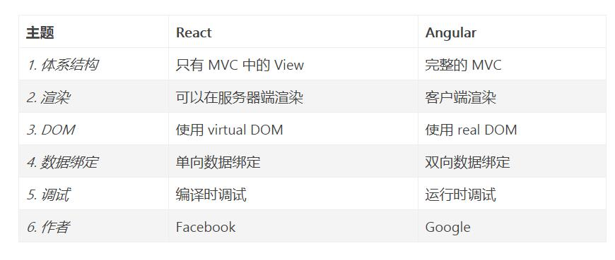

### 对于 `MVVM` 的理解？

### vue.js的两个核心是什么? 
**数据驱动、组件系统**
+ 数据驱动：ViewModel，保证数据和视图的一致性。
+ 组件系统：应用类UI可以看作全部是由组件树构成的

### Vue和jQuery的区别
+ jQuery是使用选择器（$）选取DOM对象，对其进行赋值、取值、事件绑定等操作，其实和原生的HTML的区别只在于可以更方便的选取和操作DOM对象，而数据和界面是在一起的。比如需要获取label标签的内容：$("lable").val();,它还是依赖DOM元素的值。
+ Vue则是通过Vue对象将数据和View完全分离开来了。对数据进行操作不再需要引用相应的DOM对象，可以说数据和View是分离的，他们通过Vue对象这个vm实现相互的绑定。这就是传说中的MVVM。

### Vue与AngularJS的区别
**相同点**：
+ 都支持指令：内置指令和自定义指令；
+ 都支持过滤器：内置过滤器和自定义过滤器；
+ 都支持双向数据绑定；
+ 都不支持低端浏览器。

**不同点**：
+ AngularJS的学习成本高，比如增加了Dependency Injection特性，而Vue.js本身提供的API都比较简单、直观；
+ 在性能上，AngularJS依赖对数据做脏检查，所以Watcher越多越慢；Vue.js使用基于依赖追踪的观察并且使用异步队列更新，所有的数据都是独立触发的。

### Vue与React的区别
+ Vue和React实现原理和流程基本一致，都是使用Virtual DOM + Diff算法

相同点：
+ React采用特殊的JSX语法，Vue.js在组件开发中也推崇编**写.vue特殊文件格式，对文件内容都有一些约定，两者都需要编译后使用。
+ 中心思想相同：一切都是组件，组件实例之间可以嵌套。
+ 都提供合理的钩子函数，可以让开发者定制化地去处理需求。
+ 都不内置列数AJAX，Route等功能到核心包，而是以插件的方式加载。
+ 在组件开发中都支持mixins的特性。

### React与Angular有何不同

### React
1. React采用特殊的JSX语法
2. 单向数据流
3. 兼容性好 跨浏览器兼容
4. 使用 Virtual DOM React速度很快
5. 一切都是component
6. 虚拟DOM，高效速度快，跨浏览器兼容
7. React Native
8. 灵活

### Vue 响应式编程、组件化
1、轻量级的框架
2、双向数据绑定
3、指令
4、插件化

1、简单易用
2、灵活渐进式
3、轻量高效
4、MVVM

### 虚拟DOM为什么快？
+ 减少直接操作DOM
+ 虚拟DOM不会进行排版与重绘操作
+ 虚拟DOM进行频繁修改，然后一次性比较并修改真实DOM中需要改的部分（注意！），最后并在真实DOM中进行排版与重绘，减少过多DOM节点排版与重绘损耗
+ 真实DOM频繁排版与重绘的效率是相当低的
+ 虚拟DOM有效降低大面积（真实DOM节点）的重绘与排版，因为最终与真实DOM比较差异，可以只渲染局部（同2）

## vue和react的diff算法的区别
+ vue和react的diff算法，都是忽略跨级比较，只做同级比较
+ vue diff时调动patch函数，参数是vnode和oldVnode，分别代表新旧节点。

+ vue比对节点，当节点元素类型相同，但是className不同，认为是不同类型元素，删除重建，而react会认为是同类型节点，只是修改节点属性
+ vue的列表比对，采用从两端到中间的比对方式，而react则采用从左到右依次比对的方式
    + Eg：当一个集合，只是把最后一个节点移动到了第一个，react会把前面的节点依次移动，而vue只会把最后一个节点移动到第一个
