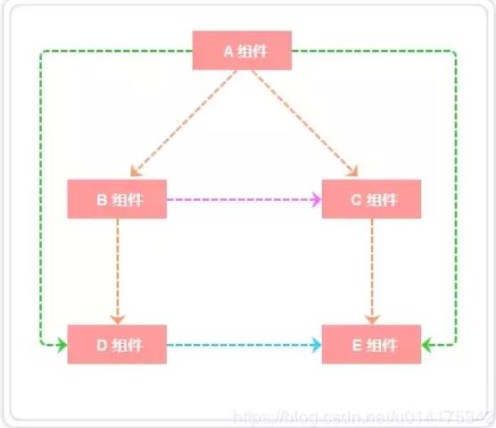
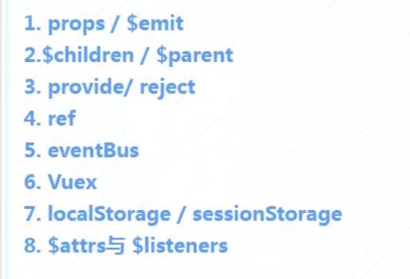
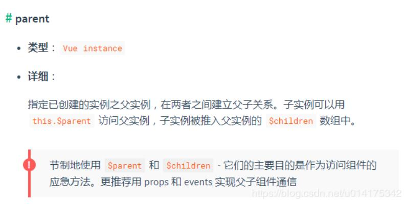

如上图所示:

 + A与B、A与C、B与D、C与E组件之间是父子关系； 
 + B与C之间是兄弟关系；
 + A与D、A与E之间是隔代关系； 
 + D与E是堂兄关系（非直系亲属） 

 针对以上关系我们归类为：
+ 父子组件之间通信
+ 非父子组件之间通信(兄弟组件、隔代关系组件等)

## 一、props / $emit 
+ 父组件通过`props`的方式向子组件传递数据，
+ 子组件通过`$emit` 的方式可以向父组件通信

### 1. 父组件向子组件传值 props
Eg: 在子组件`article.vue`中如何获取父组件`section.vue`中的数据`articles:['红楼梦', '西游记','三国演义']`
```vue
// section父组件
<template>
  <div class="section">
    <com-article :articles="articleList"></com-article>
  </div>
</template>

<script>
import comArticle from './test/article.vue'
export default {
  name: 'HelloWorld',
  components: { comArticle },
  data() {
    return {
      articleList: ['红楼梦', '西游记', '三国演义']
    }
  }
}
</script>
```
```vue
// 子组件 article.vue
<template>
  <div>
    <span v-for="(item, index) in articles" :key="index">{{item}}</span>
  </div>
</template>

<script>
export default {
  props: ['articles']
}
</script>
```

```html
父组件： <child value = '传递的数据' />
子组件: props['value'],接收数据,接受之后使用和data中定义数据使用方式一样
```

 **总结**: prop 只可以从上一级组件传递到下一级组件（父子组件），即所谓的单向数据流。而且 prop 只读，不可被修改，所有修改都会失效并警告。
 ### 2. 子组件向父组件传值  $emit 
 对于`$emit` 我自己的理解是这样的:
 + `$emit`绑定一个自定义事件, 当这个语句被执行时, 就会将参数`arg`传递给父组件,父组件通过`v-on`监听并接收参数。
 + 在父组件中给子组件绑定一个自定义的事件，子组件通过`$emit()`触发该事件并传值
```html
<!--子组件-->
<li v-for="(item, index) in goodsType" :key="index">
    <span @click="getTarget($event)" :data-app-id="item.id" :data-name="item.name"
          :data-index="item.id">{{item.name}}</span>
</li>
<!--props: ['parentmsg'],-->
getTarget (event) {
    event.preventDefault()
    this.arr = []
    let index = event.currentTarget.dataset.index
    let name = event.currentTarget.dataset.name
    this.$attrs.parentmsg = false
    this.arr.push(index, name, this.$attrs.parentmsg)
    this.$emit('func', this.arr)
}
```
```html
<!--父组件-->
<ReleaseGood v-bind:parentmsg="type" @func="getMsgFormSon"/>
getMsgFormSon (data) {
    this.gType = data
    console.log(this.gType)
    this.type = data[2]
},
```
```html
父组件： <child @receive = 'receive' />
子组件: this.$emit('receive','传递的数据')
```
通过一个例子，说明子组件如何向父组件传递数据。在上个例子的基础上, 点击页面渲染出来的article的item, 父组件中显示在数组中的下标.

 ## 二、 $children / $parent
 
 通过`$parent`和`$children`就可以访问组件的实例，拿到实例代表什么？代表可以访问此组件的所有方法和data
 ```vue
// 父组件中
<template>
  <div class="hello_world">
    <div>{{msg}}</div>
    <button @click="changeA">点击改变子组件值</button>
  </div>
</template>

<script>
export default {
  name: 'HelloWorld',
  data() {
    return {
      msg: 'Welcome'
    }
  },

  methods: {
    changeA() {
      // 获取到子组件A
      this.$children[0].messageA = 'this is new value'
    }
  }
}
</script>

 ```
```vue
// 子组件中
<template>
  <div class="com_a">
    <span>{{messageA}}</span>
    <p>获取父组件的值为:  {{parentVal}}</p>
  </div>
</template>

<script>
export default {
  data() {
    return {
      messageA: 'this is old'
    }
  },
  computed:{
    parentVal(){
      return this.$parent.msg;
    }
  }
}
</script>

```

要注意边界情况，
+ 如在`#app`上拿`$parent`得到的是`new Vue()`的实例，在这实例上再拿`$parent`得到的是`undefined`，而在最底层的子组件拿`$children`是个空数组。
+ 也要注意得到`$parent`和`$children`的值不一样，`$children`的值是数组，而`$parent`是个对象

**上面两种方式用于父子组件之间的通信， 而使用props进行父子组件通信更加普遍; 二者皆不能用于非父子组件之间的通信。**

 ## 三、provide/ inject
 `provide/ inject` 是vue2.2.0新增的api, 简单来说就是父组件中通过`provide`来提供变量, 然后再子组件中通过`inject`来注入变量。

 **注意: 这里不论子组件嵌套有多深, 只要调用了inject 那么就可以注入provide中的数据，而不局限于只能从当前父组件的props属性中回去数据**

 接下来就用一个例子来验证上面的描述: 假设有三个组件: A.vue、B.vue、C.vue 其中 C是B的子组件，B是A的子组件
 ```vue
<script>
// app.vue
export default {
provide () { //父组件中通过provide来提供变量，在子组件中通过inject来注入变量。
    return {
        reload: this.reload
    }
},
 methods: {
    reload () {
        this.isAlive = false; //先关闭，
        this.$nextTick(function () {
            this.isAlive = true   //再打开
        })
    },
}
}
</script>
 ```
```vue
<script>
export default {
  inject: ['reload'],
  methods: {
  // 刷新
	onRefresh () {
	     setTimeout(() => {
	         this.reload(); // 在想要刷新页面的时候调用reload方法
	     }, 500)
	 },
  }
}
</script>
```
## 四、ref / refs
`ref`：
+ 如果在普通的 DOM元素上使用，引用指向的就是 DOM元素；
+ 如果用在子组件上，引用就指向组件实例，可以通过实例直接调用组件的方法或访问数据
```js
// 子组件 A.vue
export default {
  data () {
    return {
      name: 'Vue.js'
    }
  },
  methods: {
    sayHello () {
      console.log('hello')
    }
  }
}
```
```vue
// 父组件 app.vue
<template>
  <component-a ref="comA"></component-a>
</template>
<script>
  export default {
    mounted () {
      const comA = this.$refs.comA;
      console.log(comA.name);  // Vue.js
      comA.sayHello();  // hello
    }
  }
</script>
```
## 五、eventBus
**eventBus** 又称为事件总线，在vue中可以使用它来作为沟通桥梁的概念, 就像是所有组件共用相同的事件中心，可以向该中心注册发送事件或接收事件， 所以组件都可以通知其他组件。
+ $on方法用来监听一个事件
+ $emit用来触发一个事件
+ $off用来移除一个事件
### 1. 初始化
```js
// event-bus.js
import Vue from 'vue'
export const EventBus = new Vue()
```
### 2. 发送事件
假设你有两个组件: additionNum 和 showNum, 这两个组件可以是兄弟组件也可以是父子组件；<br />
这里我们以兄弟组件为例:
```js
EventBus.$emit('addition', {
    num:this.num++
})
```
```vue
<template>
  <div>
    <show-num-com></show-num-com>
    <addition-num-com></addition-num-com>
  </div>
</template>
<script>
import showNumCom from './test/showNum.vue'
import additionNumCom from './test/additionNum.vue'
export default {
  components: { showNumCom, additionNumCom }
}
</script>
```
### 3. 接收事件
```js
EventBus.$on('addition', param => {
  this.count = this.count + param.num;
})
```
### 4. 移除事件监听者
```vue
<script>
import { eventBus } from './test/event-bus.js'
EventBus.$off('addition', {})
</script>
```
## 六、Vuex
 **Vuex 是一个专为 Vue.js 应用程序开发的状态管理模式**。Vuex 解决了多个视图依赖于同一状态和来自不同视图的行为需要变更同一状态的问题，将开发者的精力聚焦于数据的更新而不是数据在组件之间的传递上

**Vuex各个模块**： 
1. **state**：用于数据的存储，是store中的唯一数据源
2. **getters**：如vue中的计算属性一样，基于state数据的二次包装，常用于数据的筛选和多个数据的相关性计算
3. **mutations**：类似函数，改变state数据的唯一途径，且不能用于处理异步事件
4. **actions**：类似于mutation，用于提交mutation来改变状态，而不直接变更状态，可以包含任意异步操作
5. **modules**：类似于命名空间，用于项目中将各个模块的状态分开定义和操作，便于维护

## 七、localStorage / sessionStorage
这种通信比较简单,缺点是数据和状态比较混乱,不太容易维护。 
+ 通过`window.localStorage.getItem(key)`获取数据 
+ 通过`window.localStorage.setItem(key,value)`存储数据
+ `JSON.parse() / JSON.stringify() `做数据格式转换 
+ `localStorage / sessionStorage`可以结合`vuex`, 实现数据的持久保存,同时使用`vuex`解决数据和状态混乱问题.
## 八、 $attrs与 $listeners
在vue2.4中，为了解决该需求，引入了**$attrs** 和**$listeners** ， 新增了**inheritAttrs** 选项。 在版本2.4以前，默认情况下,父作用域中不作为 prop 被识别 (且获取) 的特性绑定 (class 和 style 除外)，将会“回退”且作为普通的HTML特性应用在子组件的根元素上。
```vue
// app.vue
// index.vue

<template>
  <div>
    <child-com1 :name="name" :age="age" :gender="gender" :height="height" title="程序员成长指北"></child-com1>
  </div>
</template>
<script>
const childCom1 = () => import("./test/childCom1.vue");
export default {
  components: { childCom1 },
  data() {
    return {
      name: "zhang",
      age: "18",
      gender: "女",
      height: "158"
    };
  }
};
</script>
```
## 总结：
**常见使用场景可以分为三类:**
+ 父子组件通信: props; $parent / $children; provide / inject ; ref ;  $attrs / $listeners
+ 兄弟组件通信: eventBus ; 	vuex
+ 跨级通信:  eventBus；Vuex；provide / inject 、$attrs / $listeners