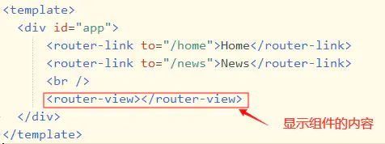

vue-router： router-link router-view  
## 什么是路由
+ 根据不同的url地址展示不同的页面或者数据。
+ 前端路由：一般用于不同的内容展示和切换
   + 前端路由多用于单页面开发，也就是SPA。
   + 前端路由是不涉及到服务器的，是前端利用hash或者HTM5的historyApi来实现的
## SPA
单页面应用所谓路由跳转，其实最终结果就是
+ 浏览器的url地址发生变化，但是其实并没有发送请求，也没有刷新整个页面
+ 根据我们配置的路由信息，每次点击切换路由，会切换到不同的组件显示，类似于选项卡功能的实现,但是同时url地址栏会变化
### 优点
+ 良好的交互体验
+ 良好的前后端工作分离模式
    + 后端不再负责模板渲染、输出页面工作，后端API通用化，即同一套后端程序代码，不用修改就可以用于Web界面、手机、平板等多种客户端
+ 减轻服务器压力
    + 单页应用相对服务器压力小，服务器只用出数据就可以，不用管展示逻辑和页面合成，吞吐能力会提高几倍
+ 避免了页面的重新加载，SPA 可以提供较为流畅的用户体验

### 缺点
1.首屏加载慢
>如果不对路由进行处理，在加载首页的时候，就会将所有组件全部加载，并向服务器请求数据，这必将拖慢加载速度；

>通过查看Network，发现整个网站加载试讲长达10几秒，加载时间最长的就是js、css文件和媒体文件及图片

解决方案：
+ Vue-router懒加载
    + Vue-router懒加载就是按需加载组件，只有当路由被访问时才会加载对应的组件，而不是在加载首页的时候就加载，项目越大，对首屏加载的速度提升得越明显
+ 使用CDN加速
    - 在做项目时，我们会用到很多库，采用CDN加载可以加快加载速度。
+ 异步加载组件
`component: ()=>import("@/components/pages/signIn/signIn")`
`component: resolve=>require(["@/components/pages/signIn/signIn"],resolve),`

+ 服务端渲染
    + 服务端渲染还能对seo优化起到作用，有利于搜索引擎抓取更多有用的信息（如果页面纯前端渲染，搜索引擎抓取到的就只是空页面）
+ vue-cli3.0使用`prerender-spa-plugin`插件预渲染
+ 首页加 loading 或 骨架屏 （仅仅是优化体验）
+ 优化 webpack 减少模块打包体积，code-split 按需加载

2.不利于SEO
+ 服务端渲染 服务器合成完整的 html 文件再输出到浏览器
+ 页面预渲染
+ 路由采用h5 history模式

3.不适合开发大型项目
+ 大型项目中可能会涉及大量的DOM操作、复杂的动画效果，也就不适合使用Vue、react框架进行开发
## 什么是vue-router
Vue Router 是 Vue.js 官方的路由管理器。
它和 Vue.js 的核心深度集成，让构建单页面应用变得易如反掌。
包含的功能有：
+ 嵌套的路由/视图表
+ 模块化的、基于组件的路由配置
+ 路由参数、查询、通配符
+ 基于 Vue.js 过渡系统的视图过渡效果
+ 细粒度的导航控制
+ 带有自动激活的 CSS class 的链接
+ HTML5 历史模式或 hash 模式，在 IE9 中自动降级
+ 自定义的滚动条行为
## 怎么使用vue-router
+ 第一步安装
+ 第二步在main.js中使用Vue Router组件
+ 第三步配置路由
    + 定义 (路由) 组件
    + 定义路由（路由对象数组）
    + 实例化Vue Router对象
    + 挂载根实例
+ 第四步在App.vue中使用路由
    + 在App.vue中使用标签来显示路由对应的组件，使用标签指定当点击时显示的对应的组件，to属性就是指定组件对应的路由。

## 怎么定义vue-router的动态路由？怎么获取传过来的动态参数？
+ 在router目录下的index.js文件中，对path属性加上/:id
+ 使用router对象的params.id获取动态参数
## vue路由传参
+ 使用query方法传入的参数使用this.$route.query接受
+ 使用params方式传入的参数使用this.$route.params接受
## router和route的区别
+ route为当前router跳转对象里面可以获取name、path、query、params等
+ router为VueRouter实例，想要导航到不同URL，则使用router.push方法
## $route 和 $router 的区别
+ router是VueRouter的一个对象，通过Vue.use(VueRouter)和VueRouter构造函数得到一个router的实例对象，这个对象中是一个全局的对象，他包含了所有的路由包含了许多关键的对象和属性
    + 想要导航到不同URL，则使用$router.push方法
    + 返回上一个history也是使用$router.go方法
+ route是一个跳转的路由对象，每一个路由都会有一个route对象，是一个局部的对象，可以获取对应的name,path,params,query等
## 路由按需加载
随着项目功能模块的增加，引入的文件数量剧增。如果不做任何处理，那么首屏加载会相当的缓慢，这个时候，路由按需加载就闪亮登场
```vue
<!--webpack< 2.4 时-->
{ 
    path:'/', 
    name:'home',
    components:resolve=>require(['@/components/home'],resolve)
} 
webpack> 2.4 时
{ 
    path:'/', 
    name:'home', 
    components:()=>import('@/components/home')
}
```
import()方法是由es6提出的，动态加载返回一个Promise对象，then方法的参数是加载到的模块
类似于Node.js的require方法，主要import()方法是异步加载的。
### vue-router实现路由懒加载（ 动态加载路由 ）
## SPA首屏加载慢如何解决
    答：安装动态懒加载所需插件；使用CDN资源。
### 为什么需要
像vue这种单页面应用，如果没有应用懒加载，运用webpack打包后的文件将会异常的大，造成进入首页时，需要加载的内容过多，时间过长，会出啊先长时间的白屏，即使做了loading也是不利于用户体验，而运用懒加载则可以将页面进行划分，需要的时候加载页面，可以有效的分担首页所承担的加载压力，减少首页加载用时，进入首页不用一次加载过多资源造成用时过长。
### 如何实现
#### 1）第一种写法：使用 AMD 风格的 require
#### 2) 第二种写法：(使用import)
#### 3) 第三种写法：使用webpack特有的require.ensure()。注：require.ensure 是 Webpack 的特殊语法，用来设置 code-split point
## vue-router解决首次加载缓慢的问题
    解决方案一：
        1. vue-router 路由懒加载
        2. 去掉编译文件中map文件
    解决方案二：
    使用CDN减小代码体积加快请求速度
    使用CDN主要解决两个问题：
        1）. 打包时间太长、打包后代码体积太大，请求慢
        2）. 服务器网络不稳带宽不高，使用cdn可以回避服务器带宽问题
## vue-router的两种模式
+ vue-router 默认 hash 模式，还有一种是history模式
+ hash模式的工作原理是hashchange事件，可以在window监听hash的变化
+ history模式利用了 HTML5 History Interface 中新增的 pushState() 和 replaceState() 方法
### 解决history模式下打包空白和刷新404的问题
+ 在config/index.js中将assetsPublicPath原来的’/‘修改为‘./’
## Vue里面router-link在电脑上有用，在安卓上没反应怎么解决
Vue路由在Android机上有问题，babel问题，安装babel polypill插件解决
## Vue2中注册在router-link上事件无效解决方法
+ 使用@click.native。
+ 原因：router-link会阻止click事件，.native指直接监听一个原生事件
## RouterLink在IE和Firefox中不起作用（路由不跳转）的问题
+ 法一：只用a标签，不使用button标签
+ 法二：使用button标签和Router.navigate方法
## Vue-router跳转和location.href有什么区别
1. 使用location.href='/url'来跳转，简单方便，但是刷新了页面。
2. 使用history.pushState('/url')，无刷新页面，静态跳转。
3. 引进router，然后使用router.push('/url')来跳转，使用了diff算法，实现了按需加载，减少了dom的消耗。

+ window.location=url 如果页面之前已经载入,则重新载入调用的是本地缓存
+ window.location.href=url 页面跳转是载入新页面方式，调用资源缓存类型是根据服务器缓存机制调用
```js
window.location.href='URL？参数名='+参数值;
window.event.returnValue=false;
```
## 什么是路由守卫？路由的钩子函数有哪些？分别说出使用的场景，及用法
    1、什么是路由守卫？  路由跳转前后做的一些验证
    2、路由常见的钩子函数 berforeRouteEnter、beforeRouteUpdate、beforeRouteLeave
    3、使用的场景:
    beforeRouteEnter:当路由进入之前:登陆验证、热力图的记录、
    beforeRouteUpdate:当路由进行更新的时候。如果当前路由发生了变化，但是不需要组件的创建销毁的过程的 时候，就需要用到这个钩子函数
    beforeRouterLeave:当路由离开的时候、当用户没有进行支付离开的时候、当用户填写完信息没有保存的时 候......
## 请说出路由配置项常用的属性及作用
    路由配置参数：    
        path : 跳转路径
        component : 路径相对于的组件
        name:命名路由
        children:子路由的配置参数(路由嵌套)
        props:路由解耦
        redirect : 重定向路由
##  router-link 相关属性
+ **to**: 表示目标路由的链接。 当被点击后，内部会立刻把 to 的值传到 router.push()，所以这个值可以是一个字符串或者是描述目标位置的对象。
+ **replace** 属性的话，当点击时，会调用 router.replace() 而不是 router.push()，导航后不会留下 history 记录。
+ **tag** 有时候想要 <router-link> 渲染成某种标签，例如 `<li>`。 于是我们使用 `tag` `prop` 类指定何种标签，同样它还是会监听点击，触发导航。
+ **append** 则在当前 (相对) 路径前添加基路径。例如，我们从 /a 导航到一个相对路径 b，如果没有配置 append，则路径为 /b，如果配了，则为 /a/b
+ **active-class** 设置 链接激活时使用的 CSS 类名
+ **event** 声明可以用来触发导航的事件
+ **exact-active-class**
## 如何实现路由解耦
    在路由的配置项中设置props:true  在需要接受组件的内部通过props进行接受
## 编程式导航使用的方法以及常用的方法
    路由跳转 ： this.$router.push()
    路由替换  : this.$router.replace()
    后退： this.$router.back()
    前进 ：this.$router.forward()
## 如何检测路由参数的变化
    通过属性监听来实现或者beforeRouterUpdate()
    watch:{    "$router"(){   
    
    } }
    beforeRouterUpdate(to,from,next);
##  vue路由的钩子函数
### 全局钩子: 
`router.beforeEach` `afterEach`
1. `to`:router即将进入的路由对象
2. `from`:当前导航即将离开的路由
3. `next`:Function,进行管道中的一个钩子，如果执行完了，则导航的状态就是 confirmed （确认的）；否则为false，终止导航。
```vue
router.beforeEach((to, from, next) => {
　　　　console.log('beforeEach')
　　　　//next() //如果要跳转的话，一定要写上next()
　　　　//next(false) //取消了导航
　　　　next() //正常跳转，不写的话，不会跳转
　　})

router.afterEach((to, from) => { // 举例: 通过跳转后改变document.title
　　　　if( to.meta.title ){
　　　　　　window.document.title = to.meta.title //每个路由下title
　　　　}else{
　　　　　　window.document.title = '默认的title'
　　　　}
　　})
```
### 针对单个路由钩子函数 
`beforeEnter`  可以在路由配置上直接定义 beforeEnter 钩子
```vue
const router = new VueRouter({
  routes: [
    {
      path: '/foo',
      component: Foo,
      beforeEnter: (to, from, next) => {
        // ...
      }
    }
  ]
})

beforeEnter(to, from, next){
　　　　console.log('beforeEnter')
　　　　next() //正常跳转，不写的话，不会跳转
　　}
```
### 组件级钩子函数 
`beforeRouteEnter` `beforeRouteUpdate` `beforeRouteLeave`
```vue
beforeRouteEnter(to, from, next){
 // 这个路由钩子函数比生命周期beforeCreate函数先执行，所以this实例还没有创建出来
　　　　console.log("beforeRouteEnter")
　　　　console.log(this) //这时this还是undefinde，因为这个时候this实例还没有创建出来
　　　　next((vm) => { //vm,可以这个vm这个参数来获取this实例,接着就可以做修改了
　　　　　　vm.text = '改变了'
　　　　})
　　},
beforeRouteUpdate(to, from, next){//可以解决二级导航时，页面只渲染一次的问题，也就是导航是否更新了，是否需要更新
　　　　console.log('beforeRouteUpdate')
　　　　next();
　　},
beforeRouteLeave(to, from, next){// 当离开组件时，是否允许离开
　　　　next()
　　}
```
```vue
const Foo = {
  template: `...`,
  beforeRouteEnter (to, from, next) {
    // 在渲染该组件的对应路由被 confirm 前调用
    // 不能获取组件实例 `this`
    // 因为当钩子执行前，组件实例还没被创建
  },
  beforeRouteUpdate (to, from, next) {
    // 在当前路由改变，但是该组件被复用时调用
    // 举例来说，对于一个带有动态参数的路径 /foo/:id，在 /foo/1 和 /foo/2 之间跳转的时候，
    // 由于会渲染同样的 Foo 组件，因此组件实例会被复用。而这个钩子就会在这个情况下被调用。
    // 可以访问组件实例 `this`
  },
  beforeRouteLeave (to, from, next) {
    // 导航离开该组件的对应路由时调用
    // 可以访问组件实例 `this`
  }
}
```
## router.push()
导航到不同的 url，向 history 栈添加一个新的记录。（=== window.history.pushState）

+ 声明式 `<router-link :to="">`
+ 编程式 `router.push()` 

```js
// 字符串
router.push('home');

// 对象
router.push({ path: 'home' });

// 命名的路由
router.push({ name: 'user', params: { userId: '123' }});

// 带查询参数，变成 /register?plan=private
router.push({ path: 'register', query: { plan: 'private' }});
```
## router.replace()
导航到不同 url，替换 history 栈中当前记录。（=== window.history.replaceState）
   + 声明式 `<router-link :to="" replace>` 
   + 编程式 `router.replace()` 

##  router.go(n)
指定前进/回退的步数:
1. n 为正数的时候是前进；
2. 负数的时候是后退；
3. 0的时候是刷新当前页面
```js
// 在浏览器记录中前进一步，等同于 history.forward()
router.go(1);

// 后退一步记录，等同于 history.back()
router.go(-1);

// 前进 3 步记录
router.go(3);

// 如果 history 记录不够用，那就默默地失败呗
router.go(-100);
router.go(100);
```
+ **router.forward()**：前进一步。
+ **router.back()**：回退一步。
### go(-1): 原页面表单中的内容会丢失；
+ history.go(-1):后退+刷新；
+ history.go(1) ：前进
### back(): 原页表表单中的内容会保留；
+ history.back():后退 ；
+ history.back(0) 刷新；
+ history.back(1)：前进

## 单页面应用和多页面应用区别及优缺点
