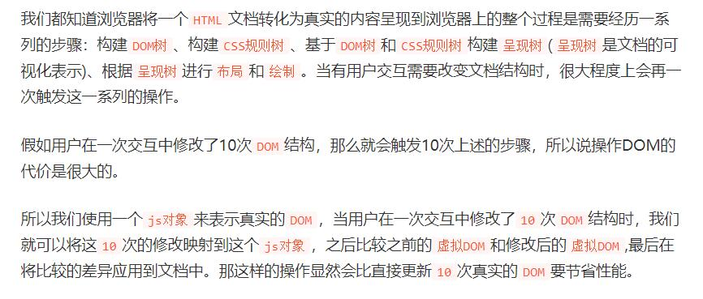

### 区分Real DOM和Virtual DOM
#### Real DOM
1. 更新缓慢
2. 可以直接更新 HTML
3. 如果元素更新，则创建新DOM
4. DOM操作代价很高
5. 消耗的内存较多
#### Virtual DOM
1. 更新更快
2. 无法直接更新 HTML
3. 如果元素更新，则更新 JSX
4. DOM 操作非常简单
5. 很少的内存消耗

### 什么是React React有什么特点 优点 限制
    React 是 Facebook 在 2011 年开发的前端 JavaScript 库。
    它遵循基于组件的方法，有助于构建可重用的UI组件
    它用于开发复杂和交互式的 Web 和移动 UI
    尽管它仅在 2015 年开源，但有一个很大的支持社区。
>React的主要功能如下：
+ 它使用虚拟DOM 而不是真正的DOM。
+ 它可以进行服务器端渲染。
+ 它遵循单向数据流或数据绑定
+ 编译时调试 只有 MVC 中的 View
>React的一些主要优点是
+ 它提高了应用的性能
+ 可以方便地在客户端和服务器端使用
+ 由于 JSX，代码的可读性很好
+ React 很容易与 Meteor，Angular 等其他框架集成
+ 使用React，编写UI测试用例变得非常容易
+ 兼容性好 跨浏览器兼容
>React的限制如下：
+ React 只是一个库，而不是一个完整的框架
+ 它的库非常庞大，需要时间来理解
+ 新手程序员可能很难理解
+ 编码变得复杂，因为它使用内联模板和 JSX

### Dom diff 原理
+ .将真实的DOM节点使用虚拟DOM表示(create)  
+ 2.将虚拟DOM渲染到浏览器页面上(render)  
+ 3.当用户操作界面修改数据后，会生成一个新的虚拟DOM，将新的虚拟DOM和旧的虚拟DOM进行对比，生成差异对象patches(diff)  
+ 4.将差异对象应用到真实的DOM节点上(patch)  

### 为什么虚拟 dom 会提高性能?
>虚拟 dom 相当于在 js 和真实 dom 中间加了一个缓存，利用 dom diff 算法避免了没有必要的 dom 操作，从而提高性能。

+ 把树形结构按照层级分解，只比较同级元素。
+ 给列表结构的每个单元添加唯一的 key 属性，方便比较。
+ React 只会匹配相同 class 的 component（这里面的 class 指的是组件的名字）
+ 合并操作，调用 component 的 setState 方法的时候, React 将其标记为 dirty.到每一个事件循环结束, React 检查所有标记 dirty 的 component 重新绘制.
+ 选择性子树渲染。开发人员可以重写 shouldComponentUpdate 提高 diff 的性能。

## 为什么需要虚拟DOM
虚拟DOM对象最基本的就三个属性：标签类型、标签元素的属性、标签元素的子节点
### 原因一：跨平台
虚拟DOM基于JavaScript对象，而真实的DOM要基于浏览器平台，所以虚拟DOM可以跨平台使用。
### 原因二：提高操作DOM的性能
+ 虚拟DOM不会进行排版与重绘操作
+ 虚拟DOM进行频繁修改，然后一次性比较并修改真实DOM中需要改的部分（注意！），最后并在真实DOM中进行排版与重绘，减少过多DOM节点排版与重绘损耗
+ 真实DOM频繁排版与重绘的效率是相当低的
+ 虚拟DOM有效降低大面积（真实DOM节点）的重绘与排版，因为最终与真实DOM比较差异，可以只渲染局部（同2）


+ 每当底层数据发生改变时，整个 UI 都将在 Virtual DOM 描述中重新渲染。
+ 然后计算之前 DOM 表示与新表示的之间的差异。
+ 完成计算后，将只用实际更改的内容更新 real DOM。

### React 中 keys 的作用是什么？
>更精准-->在虚拟dom节点中赋予key值 保证了唯一性，可以用于dom的重新渲染或是就地复用<br />
用于追踪哪些列表中元素被修改、被添加或者被移除的辅助标识<br />
借助 Key 值来判断元素与本地状态的关联关系
### 为什么浏览器无法读取JSX
>浏览器只能处理 JavaScript 对象，而不能读取常规 JavaScript 对象中的 JSX。所以为了使浏览器能够读取 JSX，首先，需要用像 Babel 这样的 JSX 转换器将 JSX 文件转换为 JavaScript 对象，然后再将其传给浏览器。
### 与 ES5 相比，React 的 ES6 语法有何不同
>1. require 与 import
```js
// ES5
let React = require('react');

// ES6
import React from 'react';
```
>2. export 与 exports
```js
// ES5
module.exports = Component;
 
// ES6
export default Component;
```
>3. component 和 function
```jsx harmony
// ES5
let MyComponent = React.createClass({
    render: function() {
        return <h3>Hello Edureka!</h3>;
    }
});
 
// ES6
class _MyComponent extends React.Component {
    render() {
        return <h3>Hello Edureka!</h3>;
    }
}
```
>4. props
```jsx harmony
// ES5
var App = React.createClass({
    propTypes: { name: React.PropTypes.string },
    render: function() {
        return <h3>Hello, {this.props.name}!</h3>;
    }
});

// ES6
class _App extends React.Component {
    render() {
        return <h3>Hello, {this.props.name}!</h3>;
    }
}
```
>5. state
```jsx harmony
// ES5
var App = React.createClass({
    getInitialState: function() {
        return { name: 'world' };
    },
    render: function() {
        return <h3>Hello, {this.state.name}!</h3>;
    }
});

// ES6
class _App extends React.Component {
    constructor() {
        super();
        this.state = { name: 'world' };
    }
    render() {
        return <h3>Hello, {this.state.name}!</h3>;
    }
}
```

