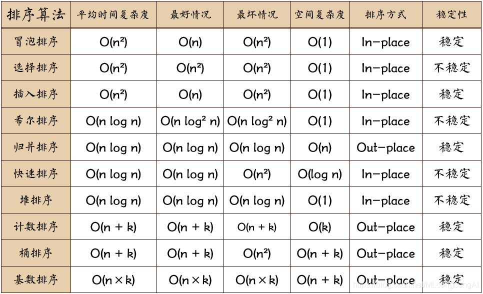
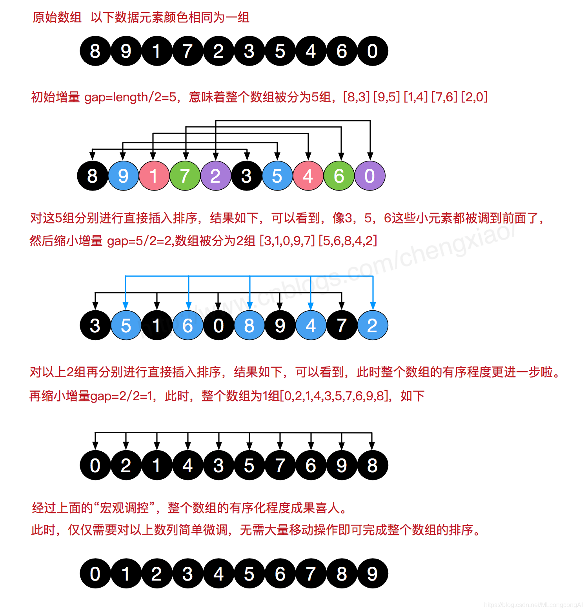

> https://blog.csdn.net/mlcongcongai/article/details/88081244

+ 堆排序、快速排序、希尔排序、直接选择排序是不稳定的排序算法，
+ 而基数排序、冒泡排序、直接插入排序、折半插入排序、归并排序是稳定的排序算法。

## 冒泡排序
+ 比较相邻的元素：如果第一个比第二个大，就交换它们两个
+ 对每一对相邻元素作同样的工作，从开始第一对到结尾的最后一对，这样在最后的元素应该会是最大的数
+ 针对所有的元素重复以上的步骤，除了最后一个
+ 重复步骤1~3，直到排序完成

+ 空间复杂度：O(1)
+ 时间复杂度：
    + 最佳情况：T(n) = O(n)
    + 最差情况：T(n) = O(n^2)
    + 平均情况：T(n) = O(n^2)

## 选择排序
+ 首先在未排序序列中找到最大（小）元素，存放到排序序列的起始位置，
+ 再从剩余未排序元素中继续寻找最大（小）元素，放到已排序序列的末尾。
+ n 个记录的直接选择排序可经过 n-1 趟直接选择排序得到有序结果

+ 时间复杂度：
    + 最佳情况：T(n) = O(n^2)
    + 最差情况：T(n) = O(n^2)
    + 平均情况：T(n) = O(n^2)
+ 空间复杂度：O(1)

## 插入排序
+ 从第一个元素开始，该元素可以认为已经被排序
+ 取出下一个元素，在已经排序的元素序列中从后向前扫描；
+ 如果该元素（已排序）大于新元素，将该元素移到下一位置；
+ 重复步骤3，直到找到已排序的元素小于或者等于新元素的位置；
+ 将新元素插入到该位置；
+ 重复步骤2~5

+ 时间复杂度：
    + 最佳情况：T(n) = O(n)
    + 最差情况：T(n) = O(n^2)
    + 平均情况：T(n) = O(n^2)
+ 空间复杂度：O(1)

## 希尔排序

