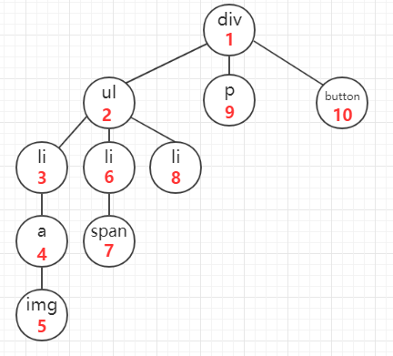
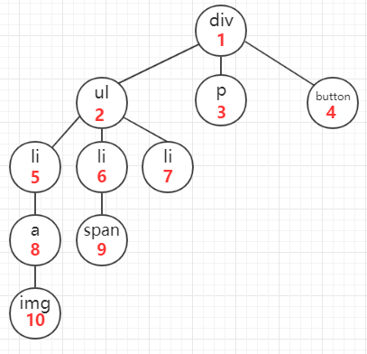

## 深度优先遍历（Depth-First Search）
+ 对每一个可能的分支路径深入到不能再深入为止，而且每个节点只能访问一次.
+ Eg: 
    + 该方法是以纵向的维度对dom树进行遍历
    + 从一个dom节点开始，一直遍历其子节点，直到它的所有子节点都被遍历完毕之后在遍历它的兄弟节点
    + 即如图所示（遍历顺序为红字锁标）：

+ 深度优先搜索是基于栈实现的,Stack 先入后出(FILO)

## 广度优先遍历
+ Eg: 
    + 该方法是以横向的维度对dom树进行遍历
    + 从该节点的第一个子节点开始，遍历其所有的兄弟节点，再遍历第一个节点的子节点，完成该遍历之后，暂时不深入，开始遍历其兄弟节点的子节点
    + 即如图所示（遍历顺序为红字锁标）：

+ 广度优先搜索是基于队列先进先出（FIFO）的数据结构实现的

## DFS和BFS的最优解情况
+ ① 比较两种算法：广度（BFS)一般无回溯操作，即人栈和出栈的操作，所以运行速度比深度优先搜索法要快些。
+ 所以一般情况下，深度（DFS)占内存少但速度较慢，广度(BFS)占内存较多但速度较快，在距离与深度成正比的情况下能较快地求出最优解。
+ ② 如果数据量较大，必须考虑溢出和节省内存空间的问题，使用深度优先搜索法较好，深度优先搜索法有递归以及非递归两种设计方法。
+ 一般的，当搜索深度较小、问题递归形式较明显时，用递归方法设计的较好，它可以使得程序结构更简捷易懂。
+ 但当搜索深度较大时，当数据量较大时，由于系统堆栈容量的限制，递归易产生溢出，用非递归方法设计比较好
+ ③ 如果数据量较小，且对程序运行的效率要求较高，或者题意是需要找出最短路径，一般使用广度优先搜索法。
