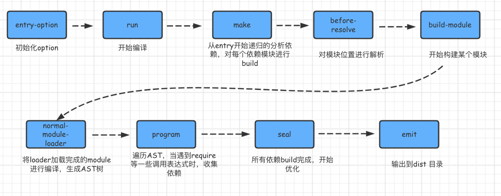

`webpack` 的运行流程是一个串行的过程，从启动到结束会依次执行以下流程：
+ 首先会从配置文件和 `Shell` 语句中读取与合并参数，并初始化需要使用的插件和配置插件等执行环境所需要的参数；
+ 初始化完成后会调用`Compiler`的`run`来真正启动`webpack`编译构建过程，webpack的构建流程包括`compile`、`make`、`build`、`seal`、`emit阶段`，执行完这些阶段就完成了构建过程。
## 初始化
### entry-options 启动 
从配置文件和 Shell 语句中读取与合并参数，得出最终的参数
### run 实例化
compiler：用上一步得到的参数初始化 `Compiler` 对象，加载所有配置的插件，执行对象的 run 方法开始执行编译
## 编译构建
### entry 确定入口
根据配置中的 entry 找出所有的入口文件
### make 编译模块
从入口文件出发，调用所有配置的 Loader 对模块进行翻译，再找出该模块依赖的模块，再递归本步骤直到所有入口依赖的文件都经过了本步骤的处理
### build module 完成模块编译
经过上面一步使用 Loader 翻译完所有模块后，得到了每个模块被翻译后的最终内容以及它们之间的依赖关系
### seal 输出资源
根据入口和模块之间的依赖关系，组装成一个个包含多个模块的 Chunk，再把每个 Chunk 转换成一个单独的文件加入到输出列表，这步是可以修改输出内容的最后机会
### emit 输出完成
在确定好输出内容后，根据配置确定输出的路径和文件名，把文件内容写入到文件系统