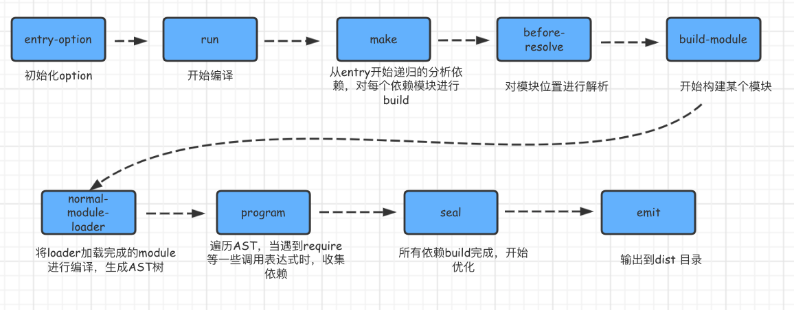
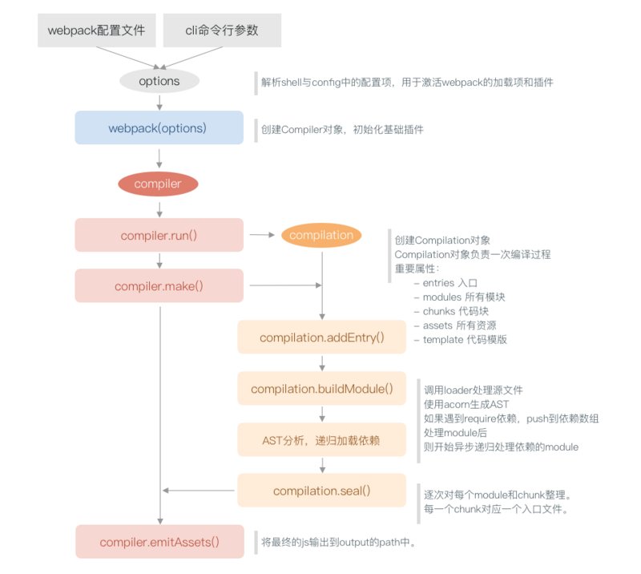

`webpack` 的运行流程是一个串行的过程，从启动到结束会依次执行以下流程：

- 首先会从配置文件和 `Shell` 语句中读取与合并参数，并初始化需要使用的插件和配置插件等执行环境所需要的参数；
- 初始化完成后会调用`Compiler`的`run`来真正启动`webpack`编译构建过程，webpack 的构建流程包括`compile`、`make`、`build`、`seal`、`emit阶段`，执行完这些阶段就完成了构建过程。

## 初始化

### entry-options 启动 参数初始化

从配置文件`【webpack.config.js】`和 Shell 语句中读取与合并参数，得出最终的参数

### run 实例化 开始编译

compiler：用上一步得到的参数初始化 `Compiler` 对象，加载所有配置的插件，执行对象的 run 方法开始执行编译

## 编译构建

### entry 确定入口

根据配置中的 entry 找出所有的入口文件

### make 编译模块

从入口文件出发，调用所有配置的 Loader 对模块进行翻译，再找出该模块依赖的模块，再递归本步骤直到所有入口依赖的文件都经过了本步骤的处理

### build module 完成模块编译

经过上面一步使用 Loader 翻译完所有模块后，得到了每个模块被翻译后的最终内容以及它们之间的依赖关系

### seal 输出资源

根据入口和模块之间的依赖关系，组装成一个个包含多个模块的 Chunk，再把每个 Chunk 转换成一个单独的文件加入到输出列表，这步是可以修改输出内容的最后机会

### emit 输出完成

在确定好输出内容后，根据配置确定输出的路径和文件名，把文件内容写入到文件系统

简单说:

- 初始化：启动构建，读取与合并配置参数，加载 Plugin，实例化 Compiler
- 编译：从 Entry 出发，针对每个 Module 串行调用对应的 Loader 去翻译文件的内容，再找到该 Module 依赖的 Module，递归地进行编译处理
- 输出：将编译后的 Module 组合成 Chunk，将 Chunk 转换成文件，输出到文件系统中

## Webpack 的热更新原理

可以做到不用刷新浏览器而将新变更的模块替换掉旧的模块

## webpack 内部执行流程-

- 将命令行参数与 webpack 配置文件 合并、解析得到参数对象。
- 参数对象传给 webpack 执行得到 Compiler 对象
- 执行 Compiler 的 run 方法开始编译。每次执行 run 编译都会生成一个 Compilation 对象
- 触发 Compiler 的 make 方法分析入口文件，调用 compilation 的 buildModule 方法创建主模块对象。
- 生成入口文件 AST(抽象语法树)，通过 AST 分析和递归加载依赖模块。
- 所有模块分析完成后，执行 compilation 的 seal 方法对每个 chunk 进行整理、优化、封装。
- 最后执行 Compiler 的 emitAssets 方法把生成的文件输出到 output 的目录中。
  

# 如何开发一个 webpack plugin

一个 webpack plugin 由如下部分组成：

1. 一个命名的 Javascript 方法或者 JavaScript 类。
2. 它的原型上需要定义一个叫做 apply 的方法。
3. 注册一个事件钩子。
4. 操作 webpack 内部实例特定数据。
5. 功能完成后，调用 webpack 提供的回调。
