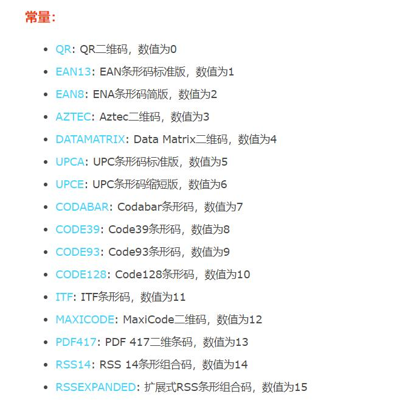

# page-skeleton-webpack-plugin

# Websocket

# 扫码

- 1.创建控件
- 2.开始扫描
- 3.结束扫描
- 4.关闭控件
<hr />

- 调用 camera 的 API
- 获取图像二进制数据
- 二维码解析模块
  > http://www.html5plus.org/doc/zh_cn/barcode.html > https://www.cnblogs.com/e0yu/p/7843505.html

## H5 barcode

Barcode 模块管理条码扫描，提供常见的条码（二维码及一维码）的扫描识别功能，可调用设备的摄像头对条码图片扫描进行数据输入。通过 plus.barcode 可获取条码码管理对象。


- 常用的常量：**QR（二维码），EAN13：一维码；**
- 方法：
  - scan: 扫码识别图片中的条码
  - create: 创建扫码识别控件对象
  - getBarcodeById: 查找扫码识别控件对象
- 对象：
  - Barcode: 扫码识别控件对象
  - BarcodeStyles: Barcode 扫码控件样式
  - BarcodeOptions: 条码识别控件扫描参数
- 回调方法：
  - BarcodeSuccessCallback: 扫码识别成功回调函数
  - BarcodeErrorCallback: 扫码识别错误回调函数

### 调用方式：

- 图片识别：这个图片是一个二维码，然后识别这个图片；
- 摄像头扫描：扫描手机上的二维码进行支付等；

#### 第一种：图片识别：

扫描图片的方法：scan：传图片的地址，和成功回调和失败回调；

```js
plus.barcode.scan(path, successCB, errorCB, filters);
```

```js
var filter = [plus.barcode.QR, plus.barcode.AZTEC];
plus.barcode.scan(path, successCB, errorCB, filter);
```

```js
// 如何识别本地的二维码
$('#startCanOne').bind('tap', function () {
  plus.gallery.pick(
    function () {
      plus.barcode.scan(
        Path,
        function (type, code, file) {
          var result =
            'type' + type + '<br/>code:' + code + '<br/>file:' + file;
          $('#info').html(result);
        },
        function (error) {
          plus.nativeUI.alert('无法识别图片');
        }
      );
    },
    function (err) {
      plus.nativeUI.alert('Failed:' + err.message);
    }
  );
});
```

#### 第二种：摄像头扫描

- 摄像头扫描用的就是：Barcode 这个对象；
- 步骤就是：首先是初始化对象，new 一个，然后 start 一下，然后进行识别，识别完成之后进行回调（回调就可以识别里面的信息）
  - 第一步：new 一个对象；new 的时候：`new plus.barcode.Barcode(id,filters,styles)`;
    - ID：对象 ID 用户识别控件的初始化；就是一个 div，一个识别二维码的一个框，就是指定一个容器；
    - filters:要识别的条形码类型过滤器，为条码类型常量数组；就是指定一个数组，能识别什么，不能识别什么；
    - styles：条码识别控件样式；
  - 第二步：指定一个回调函数；
  - 第三步：回调识别里面的信息；

```js
$('#startCan').bind('tap', function () {
  // 扫描二维码
  var barScan = new plus.barcode.Barcode('scanContainer');
  barScan.onmarked = function (type, code, file) {
    var result = 'type' + type + '<br/>code:' + code + '<br/>file:' + file;
    $('#info').html(result);
  };
  //barScan.start(); 开始扫描
  barScan.start({ conserve: true, filename: '_doc/barcode/' }); // 可以配置扫描后保存的路径
});
```

具体的实例：

```html
<header class="mui-bar mui-bar-nav">
  <a class="mui-action-back mui-icon mui-icon-left-nav mui-pull-left"></a>
  <h1 class="mui-title">扫描二维码</h1>
</header>
<div class="mui-content mui-content-padded">
  <button
    type="button"
    class="mui-btn mui-btn-blue mui-btn-block"
    id="startCan"
  >
    开始扫描
  </button>
  <button
    type="button"
    class="mui-btn mui-btn-blue mui-btn-block"
    id="startCanOne"
  >
    识别本地
  </button>
  <div
    id="scanContainer"
    style="width:300px; height:300px; border:1px solid red; margin:0px auto;"
  ></div>
  <div id="info"></div>
</div>
<script src="http://libs.baidu.com/jquery/1.8.3/jquery.min.js"></script>
<script src="js/mui.min.js"></script>
<script type="text/javascript">
  mui.plusReady(function () {
    $('#startCan').bind('tap', function () {
      // 扫描二维码
      var barScan = new plus.barcode.Barcode('scanContainer');
      barScan.onmarked = function (type, code, file) {
        var result = 'type' + type + '<br/>code:' + code + '<br/>file:' + file;
        $('#info').html(result);
      };
      //barScan.start(); 开始扫描
      barScan.start({ conserve: true, filename: '_doc/barcode/' }); // 可以配置扫描后保存的路径
    });
    // 如何识别本地的二维码
    $('#startCanOne').bind('tap', function () {
      plus.gallery.pick(
        function () {
          plus.barcode.scan(
            Path,
            function (type, code, file) {
              var result =
                'type' + type + '<br/>code:' + code + '<br/>file:' + file;
              $('#info').html(result);
            },
            function (error) {
              plus.nativeUI.alert('无法识别图片');
            }
          );
        },
        function (err) {
          plus.nativeUI.alert('Failed:' + err.message);
        }
      );
    });
  });
</script>
```

# 如果用 HTML5 做一个在线视频聊天【原创】

1. 首先使用 node.js 搭建一个简易的 websocket 服务器：
2. 接下来一个为视频者页面，另一个是观看者页面 摄像头画面时输出到 canvas
