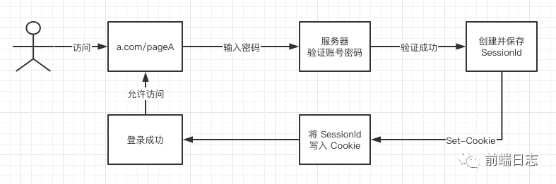

## Cookie + Session 登录

+ 用户访问 a.com/pageA，并输入密码登录
+ 服务器验证密码无误后，会创建 SessionId，并将它保存起来。
+ 服务器端响应这个 HTTP 请求，并通过 Set-Cookie 头信息，将 SessionId 写入 Cookie 中。

+ 用户访问 a.com/pageB 页面时，会自动带上第一次登录时写入的 Cookie。
+ 服务器端比对 Cookie 中的 SessionId 和保存在服务器端的 SessionId 是否一致。
+ 如果一致，则身份验证成功

问题：
+ 由于服务器端需要对接大量的客户端，也就需要存放大量的 SessionId，这样会导致服务器压力过大。
+ 如果服务器端是一个集群，为了同步登录态，需要将 SessionId 同步到每一台机器上，无形中增加了服务器端维护成本。
+ 由于 SessionId 存放在 Cookie 中，所以无法避免 CSRF 攻击

## Token 登录

+ 用户输入账号密码，并点击登录。
+ 服务器端验证账号密码无误，创建 Token。
+ 服务器端将 Token 返回给客户端，由***客户端自由保存***。

+ 用户访问 a.com/pageB 时，带上第一次登录时获取的 Token。
+ 服务器端验证 Token ，有效则身份验证成功。

### Token 机制的特点
+ 服务器端不需要存放 Token，所以不会对服务器端造成压力，即使是服务器集群，也不需要增加维护成本
+ Token 可以存放在前端任何地方，可以不用保存在 Cookie 中，提升了页面的安全性
+ Token 下发之后，只要在生效时间之内，就一直有效，如果服务器端想收回此 Token 的权限，并不容易

### Token 的生成方式
最常见的 Token 生成方式是使用 JWT 自包含的方法用于通信双方之间以 JSON 对象的形式安全的传递信息
+ 主要分为 3 个部分：header（头信息），playload（消息体），signature（签名）

## OAuth 第三方登录 前端一般使用sdk
+ 主要是后台写代码调用第三方接口验证
+ 主要是后端做，前端以location.href='xxx'的方式去请求后端接口，后端会做一些重定向，登录成功之后会把相关的信息发送给其前端。

+ 前端异步调用后端接口`/api/oauth/github`
+ 后端配置参数，并将github授权页面的地址返回给前端（以 koa 代码为例）
+ 前端跳转到github授权页面
+ 前端授权成功，页面会跳转到预先设置好的后端回掉地址 地址中会携带code
+ 后端利用code交换accessToken，并将页面重定向到前端指定的登陆后页面(网站主页)，路径中包含accessToken
+ 前端将accessToken作为参数调用后端接口`/api/oauth/github/user`，获取需要的用户信息
+ 后端用accessToken向github发起请求，获得用户信息，返回给前端
+ 前端加载用户头像

