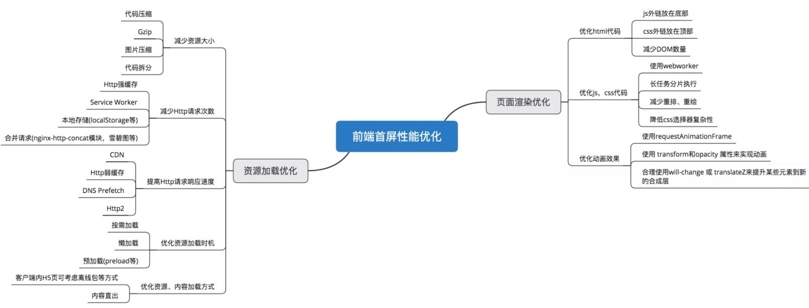

不论用户首屏的面积有多大，保证关键模块优先加载
## 资源加载优化 和 页面渲染优化

#### 使用CDN加速
+ 第一步：打开或关闭DNS预解析
    + 在做项目时，我们会用到很多库，采用cdn加载可以加快加载速度。
    + 浏览器第一次打开页面的时候，浏览器缓存是起不了作任何用的，使用CDN，效果就很明显
    + 在一些高级浏览器中，页面中所有的超链接（<a>标签），默认打开了DNS预解析。但是，如果页面中采用的https协议，很多浏览器是默认关闭了超链接的DNS预解析。如果加了上面这行代码，则表明强制打开浏览器的预解析。
+ 第二步：对指定的域名进行DNS预解析
    + 如果我们将来可能从 smyhvae.com 获取图片或音频资源，那么可以在文档顶部的 标签中加入以下内容：
    `<link rel="dns-prefetch" href="http://www.smyhvae.com/">`
#### DNS预解析
+ 可以通过在服务器端发送 X-DNS-Prefetch-Control 报头 或是在文档中使用值为 http-equiv 的meta标签
+ `<meta http-equiv="x-dns-prefetch-control" content="on">`

## 通过前端缓存和异步加载

## DOMContentLoaded 和 Load