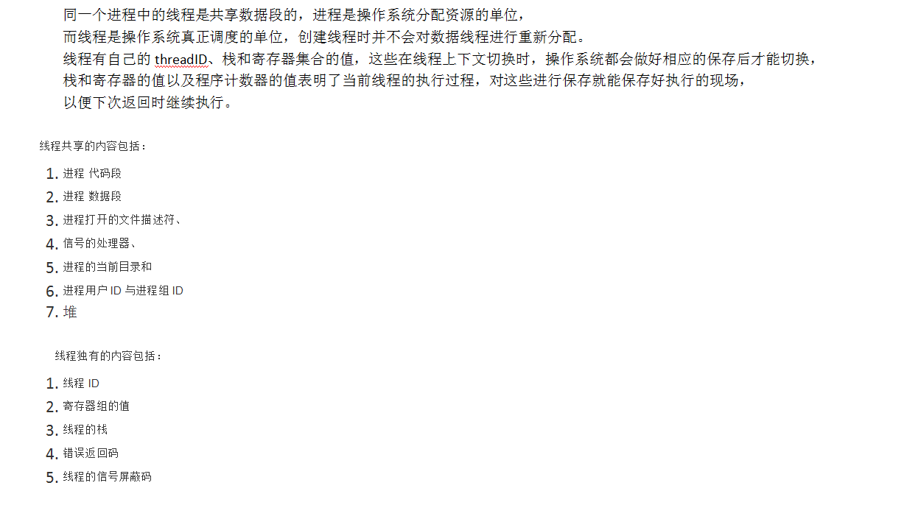

### 首先区分进程和线程
+ 进程是CPU资源分配的最小单位(是能够拥有资源和独立运行的最小单位)
+ 线程是CPU调度的最小单位
+ 一个进程由一个或多个线程组成
+ 通俗的讲：进程是一个工厂，工厂有它独立的资源，工厂之间相互独立--->进程之间相互独立，线程是工厂中的工人，多个工人之间可以协作完成任务，工厂内有一个或多个工人，工人之间共享空间。

- 工厂的资源 -> 系统分配的内存。
- 工厂之间相互独立 -> 进程之间相互独立，也即进程分配到的内存相互独立，无法读到对方内存中的数据。
- 一个工厂有一个或多个工人 -> 一个进程中有一个或多个线程。
- 多个工人协同完成工作 -> 进程中多个线程协同完成工作。即线程之间能互相发送请求与接收结果。
- 工人共享工作资源 -> 进程中所有线程都能访问到相同一块内存，即信息是互通的。

线程共享的环境包括：
+ 进程代码段
+ 进程的公有数据(利用这些共享的数据，线程很容易的实现相互之间的通讯)
+ 进程打开的文件描述符 file fd
+ 信号的处理器
+ 进程的当前目录
+ 进程用户ID与进程组ID

每个线程都有自己独立的线程上下文，包括
+ 线程ID
+ 栈、栈指针
+ 错误返回码
+ 线程的信号屏蔽码
+ 通用目的寄存器值 register set
+ 条件码 程序计数器

每个线程和其他线程一起共享进程上下文的剩余部分：用户虚拟地址空间（代码，堆，打开文件的集合）。

栈： 是个线程独有的，保存其运行状态和局部自动变量的。栈在线程开始的时候初始化，每个线程的栈互相独立，因此，栈是 thread safe 的。